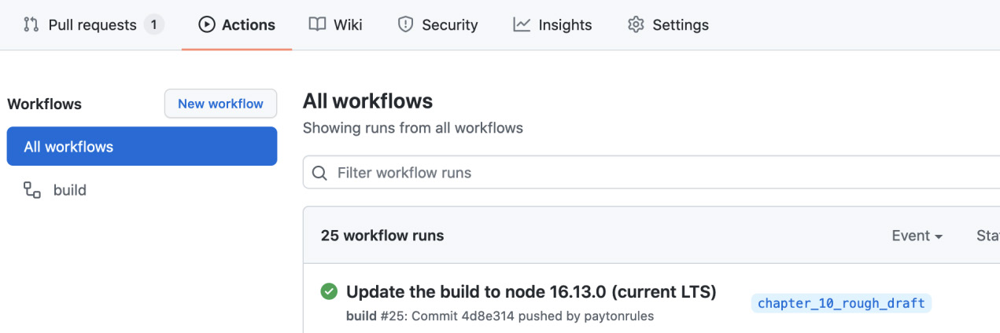

# Continuous Deployment

The traditional way to publish a game is to create a main copy of the build and ship it
off to manufacturing. This was frequently referred to as going gold inside and outside
of the gaming industry, and it still is if you're making a AAA game that's being shipped
to consoles and sold in stores. The process is time-consuming and extremely expensive;
fortunately, we don't have to do it! Walk the Dog is a web-based game that we need to ship
to a website. Since we're deploying to the web, we can use all the best practices of the web,
including continuous deployment, where we'll deploy a build whenever we want directly
from source control.

In this chapter, we'll cover the following topics:

• Creating a Continuous Integration/Continuous Delivery (CI/CD) pipeline
• Deploying test and production builds

When this chapter is complete, you'll be able to ship your game to the web! How else will
you become rich and famous?

Copying to a directory manually is a very old-fashioned way of deploying
software. 

Nowadays, we automate the build and deploy on a server, along with additional
code that's been checked into source control. It's significantly more complicated than the
old-fashioned way, so why is it better?

The practice of automating the build this way is often referred to as CD and
its definition is pretty big. 
Take a look at the following quote from https://continuousdelivery.com :

        Continuous Delivery is the ability to get changes of all types—including 
        new features, configuration changes, bug fixes, and experiments—into production, 
        or into the hands of users, safely and quickly in a sustainable way.

You might read this and think that yes, copying from your machine's dist directory onto
a server is exactly that, but it isn't. A few issues can happen when deploying manually.
We've listed a few of them here:

• The documentation could be wrong or lacking, meaning only one person knows
how to deploy.
• The deployed code might not be the same as the code in source control.
• Deployments might only work based on a local configuration, such as the version of
rustc that exists on an individual's machine.

Let's try to think about the qualities of a deployment that are safe and quick, 
as the definition says. 
We can start with the opposite of some of the preceding bullet points. 

If those are reasons why a manual deployment does not qualify as CD, 
then a process that does qualify would be able to do the following:

• Automate the process so that it is repeatable by everybody on the team.
• Always deploy from source control.
• Declare the configuration in source control, so it's never incorrect.

There's a lot more to a proper CD process than the preceding list. In fact, a "perfect" CD is
often more of a goal to be reached than an end state that you hit. Since we're a one-person
band, we won't be hitting every single bullet point from the Continuous Delivery book
( https://amzn.to/32bf9bt ), but we will be making a pipeline that builds code,
runs tests, and then deploys a test build on pull requests (PRs). Then, on merges to main ,
it will deploy to a production site. 

For this, we'll use two technologies: `GitHub Actions` and `Netlify`.

Note::
    
    CI refers to the practice of frequently merging code into the primary branch
    ( main in Git parlance) and running all the tests to ensure the code still works.
    CI/CD is a shorthand for combining the practices of integration and delivery,
    although it's a bit redundant since CD includes CI.
    

`GitHub Actions` is a relatively new technology from GitHub. It is used for running tasks
when branches are pushed to GitHub. It's well suited for running `CI/CD` because it's
built right into the source control that we're already using and has a pretty good free
tier. 
If you decide to use a different tool, such as `Travis CI` or `GitLab CI/CD`, you can use
this implementation to guide how you would use those other tools. 
At this point, the similarities outnumber the differences.

After running `CI` on `GitHub Actions`, we'll deploy to `Netlify`. 
You might be wondering why we're using `Netlify` if our stated goal is 
to reduce the number of new technologies, and that's because, 
while we can deploy directly to GitHub Pages, that won't support creating test builds. 

In my opinion, an important part of a good CD process is the ability to create production-like 
builds that can be experimented on and tried out. 

Netlify will provide that out of the box. 

If your team has grown from beyond one person, you'll be able to try out the game 
as part of the process of reviewing code in a PR. 

Also, Netlify is set up to work with Wasm out of the box, so that's handy.

Note::
    
    In GitHub parlance, a PR is a branch that you wish to merge into the main
    branch. You create a PR and ask for a review. This branch can run other checks
    before being allowed to be merged into the main branch. Other tools, such as
    GitLab, call these merge requests (MRs). I tend to stick to the term PR because
    it's what I'm used to.
    

Our pipeline will be fairly simple. On every push to a PR branch, we'll check out the
code, build and run the tests, then push to Netlify. If the build is a branch build, you'll get
a temporary URL to test out that build. If the push is to main , then it will deploy a release
build. In the future, you might want a little more rigor around production deployments,
such as tagging releases with release notes, but this should be fine to get us started.

The first step is to make sure the build machine is using the same version of Rust that
we're using locally. 
The `rustup` tool allows you to install multiple versions of the Rust
compiler along with multiple toolchains, and you'll want to make sure that everybody
on the team and along with CI is using the same version of Rust. 

Fortunately, `rustup` provides several different ways of doing this. 
We'll use the toolchain file, which is a file that specifies the toolchain 
for the current project. In addition to ensuring any machine that builds 
this crate will use the same version of Rust, it also documents the version of
Rust used for development. Every Rust project should have one.

```toml
# rust-toolchain.toml

[toolchain]
channel = "1.73.0"
targets = ["wasm32-unknown-unknown"]
```

The preceding toolchain says we'll use version 1.73.0 of the Rust compiler and the
wasm32-unknown-unknown target, so we can be sure we'll be able to compile to
WebAssembly. Now that we've ensured the version of Rust we're using, we can start setting
up a `CI/CD` pipeline in `GitHub Actions`. You're welcome to try newer versions, but this
has been tested using 1.73.0 .

### `GitHub Actions`

Like many other `CI/CD` tools, `GitHub Actions` is defined by the configuration files in
your source repository. When you create the first configuration file, called a workflow in
Actions, it will get picked up by GitHub, which will then start a runner. You can see the
output in the Actions tab of a GitHub repository. 

The following screenshot shows what the tab looked like for me while writing this chapter:



This is an example workflow being run on GitHub, where I have updated the version of
the deployment to use the LTS version of Node.js. It's a little unfortunate that you have
to go to the Actions tab to see the result of your workflows, but I suppose marketing won
out. It's also a little confusing to hear the terms workflow and pipeline thrown around.

A workflow is a specific `GitHub Actions` term referring to a series of steps run on its
infrastructure via the configuration we'll build next. A pipeline is a `CD` term referring to
a series of steps that are needed to deploy software. So, I can have a pipeline made up of
one or more workflows if I'm running it on `GitHub Actions` and using their terminology.
This pipeline will be made up of one workflow, so you can use them interchangeably.

To begin building our pipeline, we'll need to ensure we have a GitHub repository for
Walk the Dog. You probably already have one, but if you don't, you have two options to
choose from:

• Create a new repository from your existing code.
• Fork the example code.

You can do either, although it would be a shame if the code you've been writing all along
didn't exist in a repository somewhere.


---------


```rust
// src/engine.rs


```


