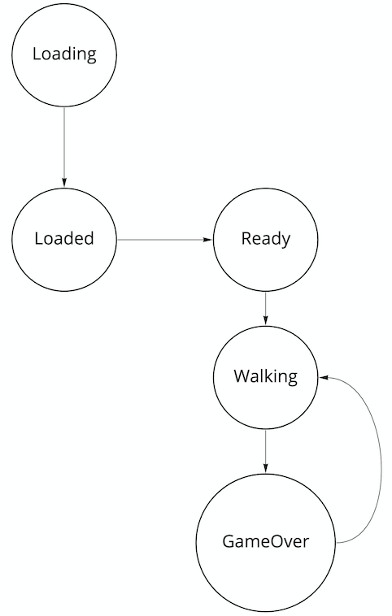

## Adding a UI

### Show the button on game over

We can show and hide the button in the Game update method by checking on each
frame if the game is over and if the button is present, ensuring that we only show or
hide it once, and that would probably work, but I think you can sense the spaghetti code
beginning to form if we do that. In general, it's best to avoid too much conditional logic
in update , as it gets confusing and allows for logic bugs. Instead, we can think of every
conditional check that looks like if (state_is_true) as two different states of the
system. So, if the new game button is shown, that's one game state, and if it isn't, that's
another game state. You know what that means – it's time for a state machine.

#### A state machine review

In Chapter 4, Managing Animations with State Machines, we converted RHB to a state
machine in order to make it change animations on events easily and, more importantly,
correctly. For instance, when we wanted `RHB` to jump, we went from `Running` to
`Jumping` via a `typestate` method, only changing the state one time and changing the
`velocity` and playing the `sound` one time. That code is reproduced here for clarity:


```rust
// src/game.rs

impl RedHatBoyState<Running> {
    ...
    pub fn jump(self) -> RedHatBoyState<Jumping> {
        RedHatBoyState {
            context: self
                .context
                .reset_frame()
                .set_vertical_velocity(JUMP_SPEED)
                .play_jump_sound(),
            _state: Jumping {},
        }
    }

```

The `typestates` work great, but they are also noisy if we don't need that kind of
functionality. That's why in that same chapter, we chose to model our game itself as a
simple `enum`, like so:

```rust
// src/game.rs

pub enum WalkTheDog {
    Loading,
    Loaded(Walk),
}

```

This is going to change significantly because we now have a problem that necessitates a
state machine. 
When `RHB` is knocked out, the game is over, and the new game button should appear. 
That's a side effect that needs to happen once, on a change of state, 
the perfect use case for our state machine. 

Unfortunately, refactoring to a state machine is going to require a not insignificant amount 
of code because our current method for implementing state machines is elegant but a little noisy. 

In addition, there's actually two state machines at work here, which is not obvious at first. 

The first is the one we see at the beginning, moving from `Loading` to `Loaded`, 
which you can think of as when you don't have Walk and when you do. 

The second is the state machine of `Walk` itself, which moves from `Ready` to `Walking` to `GameOver`. 

You can visualize it like this:





As you can see, we have two state machines here, one going from `Loading` to `Loaded`
and the other representing the three game states of `Ready`, `Walking`, and `GameOver`.

There is a third state machine, not pictured, the famous `RedHatBoyStateMachine`
that manages the `RedHatBoy` animations. A couple of the states pictured mimic
the states in `RedHatBoyStateMachine`, where `Idle` is `Ready` and `Walking`
is `Running`, so there is a temptation to move `RedHatBoyStateMachine` into
`WalkTheDogStateMachine`. 

This could work, but remember that `Walk` doesn't have a "jumping" state and so, by doing that, you'll need to start checking a Boolean, and the modeling starts to break down. 

It's best to accept the similarity because the game is heavily dependent on what `RHB` is doing, 
but treat `RedHatBoyStateMachine` as having more fine-grained states. 

What does work is turning `Loading` and `Loaded` into `Option`. 
Specifically, we'll model our game like so:

```
struct WalkTheDogGame {
    machine: Option<WalkTheDogStateMachine>
}
```
This code isn't meant to be written anywhere yet; it's just here for clarity. 

There's a big advantage to using `Option` here, and it has to do with the way our `update` function
works. 
For clarity, I'm going to reproduce a section of our `game loop` here:


```rust
// src/game.rs

let mut keystate = KeyState::new();
*g.borrow_mut() = Some(browser::create_raf_closure(move |perf: f64| {
                    process_input(&mut keystate, &mut keyevent_receiver);
                    game_loop.accumulated_delta += (perf – game_loop.last_frame) as f32;
                    
                    while game_loop.accumulated_delta > FRAME_SIZE {
                        game.update(&keystate);
                        game_loop.accumulated_delta -= FRAME_SIZE;
                    }

```

The key part here is the `game.update` line, which performs a mutable borrow on the
`game` object instead of moving it into `update`. 
This is because once `game` is owned by `FnMut`, it can't be moved out. 
Trying to actually leads to this compiler error:

```
error[E0507]: cannot move out of `*game`, as `game` is a
captured variable in an `FnMut` closure
```

Mutable borrows such as this are tricky because they can make it more challenging
to navigate the borrow checker as you proceed down the call stack. In this case, it
becomes a problem if we try to implement another state machine in the same manner as
`RedHatBoyStateMachine`. 

In our state machine implementation, each `typestate` method consumes the machine and returns a new one. 

Now, let's imagine that we are modeling the entire game as `enum`, like so:

```
enum WalkTheDogGame {
    Loading,
    Loaded(Walk),
    Walking(Walk),
    GameOver(Walk)
}
```


In order to make this work with the mutable borrow in `update`, we would have to `clone`
the entire game on every state change because the from function couldn't take ownership
of it. 
In other words, the closure in our `game.update` function lends game to the `update` function. 
This can't turn around and give it to the from function – it doesn't own
it! Doing so requires cloning the entire game, potentially on every frame!

Modeling the game as holding an optional `WalkTheDogStateMachine` has two advantages:

• We can call take on Option to get ownership of the state machine.
• The type reflects that the state machine isn't available until the game is loaded.


Note::
    
    There are, naturally, many ways to model our game type, and some of them are
    going to be better than the one we'll choose here. However, before you start
    trying to do a "simpler" version of this type, let me warn you that I tried several
    different variations on this solution and ultimately found using Option to be
    the most straightforward choice. Several other implementations either ended
    with complex borrowing or unnecessary cloning. Be wary, but also be brave.
    You may find a better way than I did!
    

Before we dig into the actual implementation, which is fairly long, let's go over the design
we're implementing.


It's pretty simple, but it doesn't do all that we need it to. Now, let's redesign the state
machine.


Yeah, that's a lot more code, and it doesn't even reflect the details of the implementation,
or the `From traits` we write to make it easy to convert between the `enum values` and
`structs`. Writing some macros to handle state machine boilerplate is out of the scope
of this book, but it's not a bad idea. You might wonder why every state holds its own
`Walk` instance when every single state has it, and that's because we're going to change
`Walk` on the transitions and the individual states don't have easy access to the parent
`WalkTheDogState` container data. However, where possible, we'll move common data
out of `Walk` and into `WalkTheDogState`.


Tip::
    
    This section has a lot of code, and the snippets tend to only show a few lines
    at a time so that it's not too much to process. However, as you're following
    along, you may wish to reorganize the code to be easier to find. For instance,
    I prefer to work top-down in the game module, with constants at the top
    followed by the "biggest" struct , which is WalkTheDog in this case,
    followed by any code it depends on, so that the call stack flows down the
    page. This is how https://github.com/PacktPublishing/
    Game-Development-with-Rust-and-WebAssembly/tree/
    chapter_8 is organized. You're also welcome to start breaking this up into
    more files. I won't, to make it easier to explain in book form.
    


---------

```rust
// src/game.rs


```


