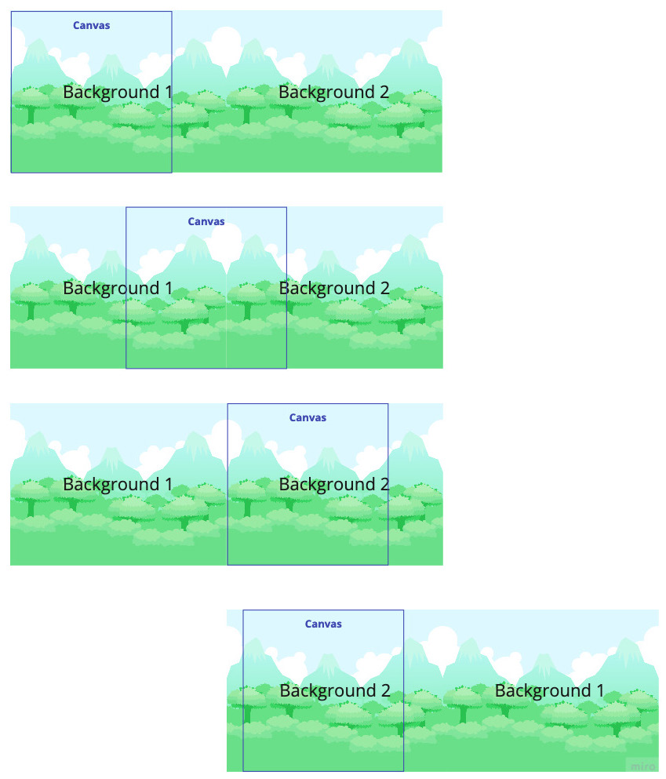

## Creating an Endless Runner

Red Hat Boy (RHB) can run, jump on a platform, and even crash into a rock and fall
over. But once he starts running to his right, he just goes off the screen and is never seen
again.

We'll make our game truly endless by generating
new scenes as RHB runs that contain new obstacles and challenges. They will even contain
randomness, and it all starts with RHB staying in one place!

We will cover the following topics:

• Scrolling the background
• Refactoring for endless running
• Creating a dynamic level

By the end of this chapter, you'll have a functioning endless runner and be able to create
obstacles for RHB to hop over and slide under.


### Scrolling the background

Repeating background technique. We'll use the same background element we're using now and move it to the left as RHB
runs to the right. Immediately after, it will become a copy of the same background,
making two Image elements with the same source image. Once the first image moves
completely off screen, we'll move it so that it's to the right of the second image. These two
backgrounds will loop, creating the illusion of the background moving forever:



This technique relies on three things. 

The first is that the background has to be seamless so that there is no visible seam between the two images. Fortunately, our background was built for this and it will work fine. 

The second is that the canvas window needs to be smaller than the background so that the entire background 
is never shown on screen.
If we do this, then the first background can go entirely off screen to the left and then be
moved to the right of the second background, all without any noticeable gaps or tearing.
This is because this all happens outside the window's boundaries. 
I like to think of it as being offstage in a play, then scrambling over to the right-hand side 
behind the curtain.

Finally, we must use another illusion and freeze the main character in place. 
Instead of moving the character from left to right on the screen, the objects will move right 
to left, almost as if on a treadmill.
 
Visually, this will look the same as if the character were running, 
and it has the advantage of fixing a bug where if the player keeps running right,
their x position eventually overflows (becomes bigger than the i16 we are using to hold it)
and the game crashes. 

We'll have to adjust our brains by changing the x velocity from what we expect, 
but once you get used to it, you'll find that it works quite easily. 
Let's get started with our scrolling background.


### Fixing RHB in x

We can scroll the background as much as we want, but if we continue to simultaneously
move `RHB` to the right at the same time, the effect will be having him run at double speed.
Instead, we want `RHB` to run in place while the rocks and platforms move toward him as
if they were on a conveyor belt. At the end of this section, we will see `RHB` run to the right
into an empty white void as everything passes past him as if he were running past the end
of the world.

Let's start in the `game::red_hat_boy_states` module 
and not update `x` in the update method of RedHatBoyContext :


```rust
// src/game.rs
impl RedHatBoyContext {
    ...
    fn update(mut self, frame_count: u8) -> Self {
        ...
        // rhb stays in-place.  
        // self.position.x += self.velocity.x
        self.position.y += self.velocity.y;

```


----------------------

```rust
// src/game.rs


```


