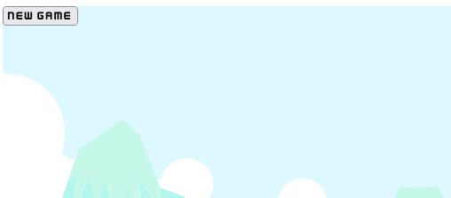
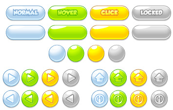
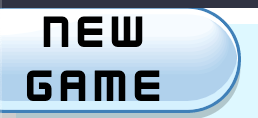

## Adding a UI


It may appear that we've developed everything we need for a video game, and to some
extent, we have, except for that annoyance where we need to hit refresh every time little
`Red Hat Boy (RHB)` hits a rock. A real game has buttons for a "new game" or "high
scores", and in this chapter, we'll be adding that `UI`. To do so may seem trivial, but event-
driven UIs that you might be familiar with from web development are an odd fit with
our game loop. To add a simple button, we'll need to make significant changes to our
application and even write a little HTML.

In this chapter, you'll do the following:

• Design a new game button
• Show the button on game over
• Start a new game

At the end of the chapter, you'll have the framework in place for a more full-featured UI
and the skills to make it work.


### Design a new game button

For now, we'll just put in a new game button that will restart from the beginning. 
This might seem like a simple task, but in fact, we'll have quite a bit to do.

First, we need to decide how we want to implement the button. 
We really have two choices. 

We can create a button in the engine, which would be a sprite that is rendered
to the canvas, the same as everything else, or we can use an HTML button and position
it over the canvas. 

The first option will look right and won't require any traditional web programming, 
but it will also require us to detect mouse clicks and handle a button-click animation. 
In other words, we'd have to implement a button. That's more than we want to implement 
to get our game working, so we're going to use a traditional HTML button and make it look 
like it's a game element.

So, we're going to write some HTML and CSS, which we can use to make the button look
like it's a part of the game engine. 
Then, we'll add the button to the screen with Rust and handle the click event. 
That will be the tough part.

#### Preparing a UI

Conceptually, our UI will work like a HUD in a FPS or where a button is superimposed
over the front of a game itself. Imagine that there is a perfectly clear pane of glass on top of
the game, and the button is a sticker that's stuck to it. 
This means, in the context of a web page, that we need a `div` that is the same size 
and in the same place as the canvas.

We can start rather quickly by updating index.html to have the required div, as follows:

```html
<!-- www/html/index.html -->

<body>
<div id="ui" style="position: absolute"></div>
<canvas id="canvas" tabindex="0" height="600" width="600">
Your browser does not support the Canvas.
</canvas>
<script src="index.js"></script>
</body>
</html>
```

Note that the `ui div` is `position: absolute` so that it doesn't "push" the canvas
element below it. You can see how this will work by putting a standard HTML button in
the div element, as follows:

```html
<!-- www/html/index.html -->

<div id="ui" style="position: absolute">
<button>New Game</button>
</div>
```

We are sticking to our no-bloat **wasm without NPM**P 
so reproduce here for quick reference is the full `index.html`:

```html
<!DOCTYPE html>
<html>
<head>
  <meta charset="UTF-8">
  <title>initial index</title>
  <link rel="stylesheet" href="../css/styles.css">
  <link rel="icon" href="../favicon_96x96.png">
</head>
<body>
<main class="container">

<div id="ui" style="position: absolute">
<button>New Game</button>
</div>

<canvas id="canvas" tabindex="0" width="600" height="600">
    Your browser does not support the Canvas.
</canvas>


</main>
  <script type="module" src="../js/index.js"></script>
</body>
</html>
```


In the CSS file, you'll want to add a style for that div. It's not really important that
this style isn't an inline one, except that this handily checks that our CSS file is being
loaded. In the CSS file, insert the following:

```css
/* www/css/styles.css */

#ui {
position: absolute;
}
```

This is a CSS selector for any elements with the ui ID and sets their position to
absolute. 
If your CSS file is being loaded, then the new game button should be over the
top of the canvas again. 

Later, we'll programmatically add that button in our game code,
but for now, we just want it to show up and look right. 

We'll want to give it a font that looks like a video game, 
and a background too. 

Let's start with the font. In your assets, you'll see there is a directory called ui, 
which contains a file named `kenney_future_narrow-webfont.woff2`. 
WOFF stands for Web Open Font Format and is a font format that will work in every modern browser.

Copy `kenney_future_narrow-webfont.woff2` into the static directory in
your application (we have it at www/fonts/) so that it gets picked up by the build process. 
Then, you need to specify `@font-face` in CSS so that elements can be rendered in it, 
which looks like so:

```css
/* www/css/styles.css */

@font-face {
    font-family: 'Ken Future';
    src: url('../resources/fonts/kenney_future_narrow-webfont.woff2');
}

```

What we've done here is load a new font face with the simple name ' Ken Future ' so
that we can reference it in other styles, and loaded it via the specified URL. Now, we can
change all buttons to use that font with this additional CSS:

```css
/* www/css/styles.css */

button {
font-family: 'Ken Future';
}
```


The button still looks a lot like an HTML button because of that traditional web
background. To make it look more like a game button, we'll use a background and CSS
Sprites to create a pretty button with rounded corners and hover colors.



#### CSS Sprites
As a game developer, you already know what a sprite is; you haven't forgotten Chapter 2,
Drawing Sprites, already, have you? In the case of CSS Sprites, the term as commonly used
is a bit of a misnomer, as instead of referring to a sprite, it really refers to a sprite sheet.
Conceptually, CSS Sprites work the same way as rendering them with the canvas. You
slice out a chunk of a larger sprite and only render that portion. We'll just do the entire
thing in CSS instead of Rust. Since we're using CSS, we can change the background
when the mouse is over the button and when it is clicked. This will make the button look
correct, and we won't have to write Rust code to have the same effect. Clicking a button is
something a browser is very good at, so we'll leverage it.
We'll use the Button.svg file from the ui directory in the downloaded assets, so you
can copy that file to the static directory in your game's project. The SVG file actually
contains an entire library of buttons, which looks like this:



We'll want to slice out the wide blue, green, and yellow buttons to be the background for
the button in various states. We'll start by using the background attribute in CSS to set
the button's background to the SVG file. You'll update the style as follows:


```css
/* www/css/styles.css */

button {
font-family: 'Ken Future';
background: -72px -60px url('../resources/pix/Button.svg');
}
```

The pixel values in background , `-72px` and `-60px`, mean taking the background
and shifting it 72 pixels to the left and 60 pixels upward to line it up with the blank blue
button. 
You can get those values in a vector graphics editor such as Inkscape. 

The url value specifies which file to load. 
Make those changes, and you'll see the button change to have a new background... well, sort of.


As you can see, the background is cut off, so you only get half of it, and the button itself
still has some of the effects of a default HTML button. We can get rid of those effects with
a little more CSS to remove the border and resize the button to match the background, 
as shown here:

```css
/* www/css/styles.css */

button {
font-family: 'Ken Future';
background: -72px -60px url('../resources/pix/Button.svg');
border: none;
width: 82px;
height: 33px;
}
```

The `width` and `height` values were plucked from *Inkscape~ again, and that will set
the button to be the same size as the button background in the source. As with the sprite
sheets we used earlier, we need to cut out a slice from the original source, so in this case,
there is a rectangle starting at (72, 60) with a width and height of 82x33 . With those
changes, the button now looks like a game button instead of a web button.


There are still a few problems. The button now doesn't visually interact with the user, so it
just looks like a picture when you click it. We can address that with CSS pseudo-classes for
`#active` and `#hover`.

Note::
    
    Some browsers, notably Firefox, 
    will render New Game on one line instead of two.
    

In each pseudo-class, we'll change the background attribute to line up with another
background. Again, the numbers were pulled out of Inkscape, with a little tweaking once
they were added to make sure that they lined up. First, we can handle the hover style,
which is when the mouse is over the image.
That produces a hover button that looks like this:

```css
/* www/css/styles.css */

button:hover {
background: -158px -60px url('../resources/pix/Button.svg');
}
```


Then, we'll add the active style, which is what the mouse will look like when clicked:

```css
/* www/css/styles.css */

button:active {
background: -244px -60px url('../resources/pix/Button.svg');
}
```


The final issue is that our button is really small, for a game anyway, and is positioned at the
upper-left corner. Making the button larger the traditional CSS way with width and height
is problematic, as shown here when we change the width value:


Changing the width or height will mean changing the "slice" that we're taking from
the sprite sheet, so we don't want that. 
What we'll use instead is the CSS translate property, 
with the `scale` function, which looks like so:

```css
/* www/css/styles.css */

button {
    ...
    transform: scale(1.8);
}
```

This gives us a nice large button with the right background, but it's not in the right spot.



Now that the button is large and looks like a game button, we just need to put it in the
right spot. You can do that by adding `translate` to the transform property, where
translate is a **fancy way of saying move**. 

You can see that as follows:


```css
/* www/css/styles.css */

button {
    ...
    transform: scale(1.8) translate(150px, 100px);
}
```

The new game button now shows up, but it doesn't do anything because our code
isn't doing anything with `onclick`. It's just a floating button, taunting us with its
ineffectiveness. Go ahead and remove the button element from `index.html` , but
keep `div` with the `ui` ID. 

Instead, we'll use Rust to dynamically add and remove the button when we need it 
and actually handle the clicks. 
For that, we'll want to make some additions to our browser and engine modules, 
so let's dig in.

---------

```rust
// src/game.rs


```


