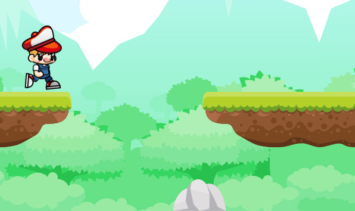
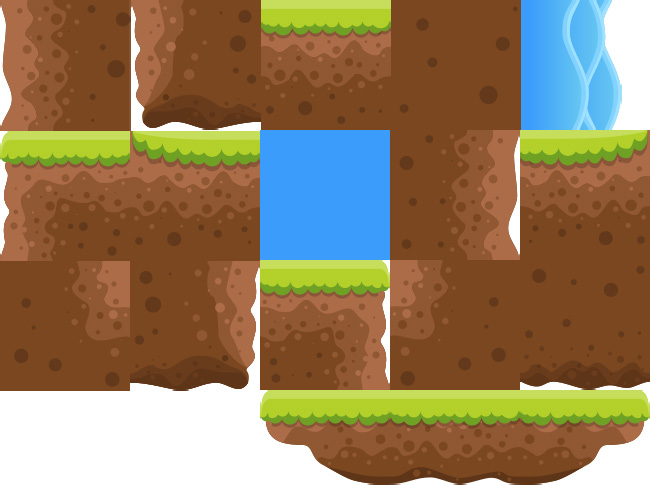

## Creating a dynamic level

The initial screen we've been looking at for so long, with RHB jumping from a stone onto
a platform, is what we're going to call a "*segment*." 
It's not a technical term, just a concept we've made up for the sake of generating them. 
As RHB moves to the right (that is, when all the obstacles move to the left), 
we'll generate new segments to the right, which is just off screen. 
We'll create these as segments so that we can control what is generated and how they fit together. 

Think of it like this: if we generated obstacles at random, then our platforms would look messy 
and would arrange themselves in an unbeatable fashion, like so:


Instead, what we'll do is create a segment where the first one looks exactly like our one
platform and one rock, and have them string together via a "*timeline*" value that's stored
in `Walk`. 

This `timeline` will represent the right-hand side of the last segment in `x`. 
As that value gets closer to the edge of the screen, we'll generate another new `segment` 
and move the `timeline` back out. 

With this approach, `RHB` will be able to run for as long as we like, and we will have the freedom 
of a level designer. We will be able to create segments that are both easy and hard to navigate, 
though we'll need to make sure they all interlock and can be beaten. 
This is the fun part!

### Creating one segment

We'll start by taking the introductory screen and creating it as a `segment`. 
Let's do this by creating a new file called `segments.rs`, 
making sure to add `mod segments` to the `lib.rs` file. 
This module isn't created for the typical software design reasons; 
usually, it's because `game.rs` is getting pretty long 
and these segments are closer to being levels than they are true code.

```sh
$ touch src/segments.rs
```

```rust
// src/lib.rs

...
mod game;
mod segments;
...
use engine::GameLoop;
...
```

Each segment will be a function that returns a list of obstacles. Let's create a public
function in segments.rs that returns the same list that the game is initialized with:


```rust
// src/segments.rs

pub fn stone_and_platform( 
            stone: HtmlImageElement, 
            sprite_sheet: Rc<SpriteSheet>, 
            offset_x: i16, ) -> Vec<Box<dyn Obstacle>> {

        const INITIAL_STONE_OFFSET: i16 = 150;
        vec![
            Box::new(Barrier::new(Image::new(
                stone,
                Point {
                    x: offset_x + INITIAL_STONE_OFFSET,
                    y: STONE_ON_GROUND,
                },
            ))),
            Box::new(create_floating_platform(
                sprite_sheet,
                Point {
                    x: offset_x + FIRST_PLATFORM,
                    y: LOW_PLATFORM,
            },
            )),
        ]
}

```

Look, constants! 
We want the segments module to look as data-driven as possible, 
so we'll be using constants throughout this file. 

This section of code doesn't compile because the `create_floating_platform` function doesn't exist yet, 
but it does the same things that the corresponding code in the `initialize` method of `WalkTheDog` does. 
The only differences are that it uses the `create_floating_platform` function, which
doesn't exist, and some constants that also do not exist.

The function itself takes `HtmlImageElement` from `stone` and `Rc<SpriteSheet>`
to create `Barrier` and `Platform`, respectively, but it also takes an `offset_x`
value. 
That's because while the first `Barrier` and `Platform` may be at 150 and
200, respectively, in the future, we'll want those to be that many pixels away from the
`timeline`. 

It returns a vector of `obstacles`, which we can use in the `initialize` method of
`WalkTheDog` and anywhere else that we generate segments.


Information::
        
        You may have noticed that we used an Rc for SpriteSheet but just take
        ownership of HtmlImageElement , which may need to be cloned when it's
        called. Nice catch! You may wish to consider making HtmlImageElement
        an Rc as well. HtmlImageElement is small enough that it's probably
        fine if we clone it, but it may be worth investigating in Chapter 9,
        Testing, Debugging, and Performance.
        

Let's continue by creating the function that's missing – that is, 
`create_floating_platform`:


```rust
// src/segments.rs

fn create_floating_platform(sprite_sheet: Rc<SpriteSheet>, 
                            position: Point) -> Platform {
    Platform::new(
        sprite_sheet,
        position,
        &FLOATING_PLATFORM_SPRITES,
        &FLOATING_PLATFORM_BOUNDING_BOXES,
    )
}

```

This is a pretty small function in that it just delegates to the `Platform` constructor 
and passes along important information. 
As you can see, there are two new constants to go along with the others in `stone_and_platform`.


Tip::
        
    If you want to use `Rect::new_from_x_y` when you're declaring
    `FLOATING_PLATFORM_BOUNDING_BOXES`, you'll need to declare it 
    and `Rect::new` as `pub const fn`.


The rest of the segments module consists of constants and use statements. 
You can infer the values for all the constants from the code we used earlier, 
or just check out https://github.com/PacktPublishing/Game-Development-with-Rust-
and-WebAssembly/blob/chapter_6/src/segments.rs . 
By putting all the values in constants, the code looks increasingly data-driven, 
with functions just returning the data we want for every segment.

```rust
// src/segments.rs
use std::rc::Rc;
use web_sys::HtmlImageElement;


use crate::game::{Barrier, Obstacle, Platform};
use crate::engine::{Image, Point, Rect, SpriteSheet};

const LOW_PLATFORM: i16 = 420;
const HIGH_PLATFORM: i16 = 375;
const FIRST_PLATFORM: i16 = 370;
const STONE_ON_GROUND: i16 = 546;

const FLOATING_PLATFORM_SPRITES: [&str; 3] = ["13.png", "14.png", "15.png"];
const PLATFORM_WIDTH: i16 = 384;
const PLATFORM_HEIGHT: i16 = 93;
const PLATFORM_EDGE_WIDTH: i16 = 60;
const PLATFORM_EDGE_HEIGHT: i16 = 54;
const FLOATING_PLATFORM_BOUNDING_BOXES: [Rect; 3] = [
    Rect::new_from_x_y(0, 0, PLATFORM_EDGE_WIDTH, PLATFORM_EDGE_HEIGHT),
    Rect::new_from_x_y(
        PLATFORM_EDGE_WIDTH,
        0,
        PLATFORM_WIDTH - (PLATFORM_EDGE_WIDTH * 2),
        PLATFORM_HEIGHT,
    ),
    Rect::new_from_x_y(
        PLATFORM_WIDTH - PLATFORM_EDGE_WIDTH,
        0,
        PLATFORM_EDGE_WIDTH,
        PLATFORM_EDGE_HEIGHT,
    ),
];


```
    
Once you've filled in the constants and the use statements, 
you can use the new `stone_and_platform` function in the `initialize` method of `WalkTheDog`. 
Yeah, that one again. 
Let's replace the hardcoded list of obstacles with a call to this new function:


```rust
// src/game.rs


#[async_trait(?Send)]
impl Game for WalkTheDog {
    async fn initialize(&self) -> Result<Box<dyn Game>> {
        match self {
            WalkTheDog::Loading => {
                ...
                /*
                let obstacles = vec![ Box::new(Barrier::new(
                                                 Image::new( stone, Point { x: 150, y: 546 }))),
                                      Box::new(platform),
                                            ];
                */
                let obstacles = stone_and_platform(stone, sprite_sheet.clone(), 0);
```


Make sure you bring in scope stone_and_platform from segments! 


```rust
// src/game.rs

use crate::{
    browser,
    engine::{self, Cell, Game, Image, KeyState, Point, Rect, Renderer, Sheet, SpriteSheet},
    segments::stone_and_platform,
};

```

NOTE::
        You may have noticed that this puts a circular dependency between segments
        and game . You're right. To fix this, take anything that segments depends on
        that is in game and put it in another module that both game and segments
        depend on. This has been left as an exercise for you.

Sticking with the book's source code for now. We risk to be too much out of sync to make sense of the rest of the book as it has multiple gaps and omissions making following the code a little more challenging 

Now that we've got a function to create the initial scene, 
we can add a timeline and start generating scenes again and again. 
Let's get started.

### Adding a timeline

We need to `initialize` the `timeline` at the `width` of a `segment`. 
We can calculate this by finding the right-most point in the list of obstacles, 
and we'll use those cool functional constructs we used earlier. 
This will be a standalone function that we can keep in the `game` module, 
which looks like this:


```rust
// src/game.rs


fn rightmost(obstacle_list: &Vec<Box<dyn Obstacle>>) -> i16 {
    obstacle_list
        .iter()
        .map(|obstacle| obstacle.right())
        .max_by(|x, y| x.cmp(&y))
        .unwrap_or(0)
}
```

This function goes through a vec of `Obstacle` and gets its `right` value. 
Then, it uses the `max_by` function to figure out the maximum value on the `right`. 
Finally, it uses `unwrap_or` because while `max_by` can technically return `None`, 
if it does that here, then we have completely screwed up 
and may as well shove all the graphics onto the leftmost part of the screen. 

Now that we have this function, we can add a `timeline` value to the `Walk` struct.
We also added a reference to HtmlImageElement because we'll need that later:

```rust
// src/game.rs

pub struct Walk {
    obstacle_sheet: Rc<SpriteSheet>,
    boy: RedHatBoy,
    backgrounds: [Image; 2],
    obstacles: Vec<Box<dyn Obstacle>>,
    
    stone: HtmlImageElement,
    timeline: i16,
}


```

We will now initialize Walk – yes, we're back in that function again – with stone and
timeline. 

We'll have to tweak the code slightly to deal with the borrow checker:


```rust
// src/game.rs


#[async_trait(?Send)]
impl Game for WalkTheDog {
    async fn initialize(&self) -> Result<Box<dyn Game>> {
        match self {
            WalkTheDog::Loading => {
                ...

                //let obstacles = stone_and_platform(stone, sprite_sheet.clone(), 0);
                let starting_obstacles = stone_and_platform(stone.clone(), sprite_sheet.clone(), 0);
                let timeline = rightmost(&starting_obstacles);

                let walk = Walk {   boy: rhb, 
                                    backgrounds: backgrounds,
                                    obstacles: starting_obstacles, // obstacles,
                                    obstacle_sheet: sprite_sheet,

                                    stone: stone, 
                                    timeline: timeline,
                                };
```

Here, we bind `starting_obstacles` and `timeline` before we initialize `Walk` 
since we wouldn't be able to get `timeline` as we've moved `obstacles` already. 
Note how we now clone `stone` when we pass it into `stone_and_platform`. 
We'll need to do this from now on because each `Barrier` obstacle owns an `Image` and, 
ultimately, its `HtmlImageElement`. 
Finally, we pass `stone` and `timeline` into the `Walk` struct.

Now that we have a `timeline` field we can update it, 
by moving the rightmost edge of the generated obstacles to the left on each update, 
and respond to it by generating more obstacles as necessary. 

Our `Canvas` is still 600 pixels wide, so let's say that if there are no
obstacles at the rightmost point past 1000, we need to generate more.

These changes belong in the `update` method of `WalkTheDog`, at the end of the `update`
logic:


```rust
// src/game.rs

impl Game for WalkTheDog {
    ...
    fn update(&mut self, keystate: &KeyState) {
        if let WalkTheDog::Loaded(walk) = self {
            ...
            walk.obstacles.iter_mut().for_each(|obstacle| {
                obstacle.move_horizontally(velocity);
                obstacle.check_intersection(&mut walk.boy);
            });


            if walk.timeline < TIMELINE_MINIMUM {
                let mut next_obstacles = stone_and_platform(
                                            walk.stone.clone(),
                                            walk.obstacle_sheet.clone(),
                                            walk.timeline + OBSTACLE_BUFFER,
                                        );
                walk.timeline = rightmost(&next_obstacles);
                walk.obstacles.append(&mut next_obstacles);
            } else {
                walk.timeline += velocity;
            }
            


```
After moving the obstacles, we check whether `walk.timeline is < TIMELINE_MINIMUM`, 
which is set to 1000 at the top of the module. 
If it is, we create another `stone_and_platform` segment at `walk.timeline + OBSTACLE_BUFFER`, 
which is another constant that's set to 20. 


```rust
// src/game.rs

const HEIGHT: i16 = 600;
const TIMELINE_MINIMUM: i16 = 1000;
const OBSTACLE_BUFFER: i16 = 20;

```

Why 20? 
We needed a little buffer to make sure the segments weren't right on top of each other, and 20 seemed fine. 
You could use a larger number or none at all. 

Then, we update `walk.timeline` to the rightmost point of the new obstacles, 
and we append those obstacles to the list, ready to be drawn.

If `walk.timeline` is beyond `TIMELINE_MINIMUM`, we simply decrease it by RHB's
walking `speed` until the next update. 
Upon adding this code, you should see something similar to the following:




That's right – you have an endless runner! 
So, how come we're only halfway through this book? 
Well, our runner is a little dull, seeing as it only has the same two objects over 
and over again. 

How about we add some randomness and creativity with multiple segments?

### Creating segments

Creating random segments means using the random library to choose a different segment
each time one is needed. 
Let's start by extracting the code we wrote previously into a function, as shown here:

```rust
// src/game.rs

impl Game for WalkTheDog {
    ...
    fn update(&mut self, keystate: &KeyState) {
        if let WalkTheDog::Loaded(walk) = self {
            ...
            if walk.timeline < TIMELINE_MINIMUM {
                walk.generate_next_segment()
            } else {
                walk.timeline += velocity;
            }
        }
        ...
    }
}


```

And generate_next_segment is in `impl Walk`:

```rust
// src/game.rs

impl Walk {
...
    fn generate_next_segment(&mut self) {

        let mut next_obstacles = stone_and_platform(
                                    self.stone.clone(),
                                    self.obstacle_sheet.clone(),
                                    self.timeline + OBSTACLE_BUFFER,
                                );
        self.timeline = rightmost(&next_obstacles);
        self.obstacles.append(&mut next_obstacles);
    }//^-- fn generate_next_segment
}//^-- impl Walk

```
INFO:

WalkTheDog has a bad case of [feature envy](https://refactoring.guru/smells/feature-envy), 
another one of those code smells we talked about previously.
But as this game gets extended, we'll want to move more code out of `WalkTheDog` and into `Walk`.


Now that `Walk` can generate the next segment, we'll use the `random` crate from
Chapter 1, Hello WebAssembly, to choose the next segment. 

Of course, we only have one segment, so that won't mean much. 
It looks like this:

```rust
// src/game.rs

impl Walk {
    ...
    fn generate_next_segment(&mut self) {
        let mut rng = thread_rng();
        let next_segment = rng.gen_range(0..1);
        
        let mut next_obstacles = match next_segment {
            0 => stone_and_platform(
                self.stone.clone(),
                self.obstacle_sheet.clone(),
                self.timeline + OBSTACLE_BUFFER,
                ),
            _ => vec![],
        };

        self.timeline = rightmost(&next_obstacles);
        self.obstacles.append(&mut next_obstacles);

    }//^-- fn generate_next_segment
}//^-- impl Walk

```

also add

```rust
// src/game.rs

...
use rand::{thread_rng, Rng};
//use rand::prelude::*;
```

Don't forget to add `use rand::prelude::*;` at the top of the file. 
This generates a random number between 0 and, well, 0. 
Then, it matches that value and generates the selected segment, 
which in this case will always be stone_and_platform . 
There's a default case here, but that's just to quiet the compiler – it can't happen. 
I'll create a second segment called `platform_and_stone` that is the same as the first one 
except it flips the position of stone and platform, and then puts the platform higher 
by using the `HIGH_PLATFORM` constant we created earlier. 

Now, the `generate_next_segment` function looks like this:


```rust
// src/game.rs

impl Walk {
    ...
    fn generate_next_segment(&mut self) {
        let mut rng = thread_rng();
        let next_segment = rng.gen_range(0..2);

        let mut next_obstacles = match next_segment {
            0 => stone_and_platform(
                self.stone.clone(),
                self.obstacle_sheet.clone(),
                self.timeline + OBSTACLE_BUFFER,
            ),
            1 => platform_and_stone(
                self.stone.clone(),
                self.obstacle_sheet.clone(),
                self.timeline + OBSTACLE_BUFFER,
            ),
            _ =>vec![],
        };

        self.timeline = rightmost(&next_obstacles);
        self.obstacles.append(&mut next_obstacles);

    }//^-- fn generate_next_segment
}//^-- impl Walk


```

In `segments.rs` we add:

```rust
// src/segments.rs

...
const HIGH_PLATFORM: i16 = 375;
...

pub fn platform_and_stone(
    stone: HtmlImageElement,
    sprite_sheet: Rc<SpriteSheet>,
    offset_x: i16,
) -> Vec<Box<dyn Obstacle>> {
    const INITIAL_STONE_OFFSET: i16 = 400;
    const INITIAL_PLATFORM_OFFSET: i16 = 200;

    vec![
        Box::new(Barrier::new(Image::new(
            stone,
            Point {
                x: offset_x + INITIAL_STONE_OFFSET,
                y: STONE_ON_GROUND,
            },
        ))),
        Box::new(create_floating_platform(
            sprite_sheet,
            Point {
                x: offset_x + INITIAL_PLATFORM_OFFSET,
                y: HIGH_PLATFORM,
            },
        )),
    ]
}

```

Here, you can see that I get two segments, both of which are called in the same way.
Make sure gen_range now generates a number from 0 to 2. 
Upon running this code, I get to see a new segment:

If you try to copy/paste the preceding code, it won't work since you don't have
`platform_and_stone`. 
This hasn't been included here because you have all the knowledge you need to create your own segments. 
You can start by copying/pasting `stone_and_platform` and tweaking its values. 
Then, you can try creating platforms with the sprite sheet. 
Remember that you're not limited to just the three images in our sprite sheet. 
The entire sheet looks like this:




Nothing will change  until we deal with
`error[E0015]: cannot call non-const fn `Rect::new_from_x_y` in constants`

```rust
// src/engine.rs

/* //This was thebug!!!!
    // error[E0015]: cannot call non-const fn `Rect::new_from_x_y` in constants
    pub fn new(position: Point, width: i16, height: i16) -> Self {
        Rect {
            position,
            width,
            height,
        }
    }

    pub fn new_from_x_y(x: i16, y: i16, width: i16, height: i16) -> Self {
        Rect::new(Point { x, y }, width, height)
    }
*/
    pub const fn new(position: Point, width: i16, height: i16) -> Self {
        Rect {
            position,
            width,
            height,
        }
    }

    pub const fn new_from_x_y(x: i16, y: i16, width: i16, height: i16) -> Self {
        Rect::new(Point { x, y }, width, height)
    }


```
 
You can use this to make larger platforms, steps, and even cliffs. Try making a few
different shapes. Try making smaller platforms by skipping the middle tile in the platform
we've been using. RHB can slide; can you make something for him to slide under?

For a real challenge, take a look at the water sprites. Currently, RHB can't fall through the
ground since we're using a FLOOR variable, but what if we didn't? Could RHB drown? Fall
off a cliff, perhaps? It's time to become a game designer!


Note: I tried to be too clever with my
build script and end up losing time because things did not really update. 
and old stale files ended up being served hiding the fact that something went wrong with the new modifications.
 
We need to remove old pkg. Sometimes things don't update after modifications.
`rm -fr www/pkg`

Also although stopping at the first error is convenient, we are chaining commands 
Lets revert to simple things so the run script is like this:

```sh
#!/bin/sh

## pre-req a web server
# cargo install http

## exit on error and  prints each executed command
set -ex

## remove old pkg somethings dont update after modifications
rm -fr www/pkg

## compile for plain vanilla no javascript framework 
wasm-pack build --target web --out-dir www/pkg  
#--color=always 2>&1 | less -R

## display link for easy access
echo "Serving at: http://127.0.0.1:8080/html/"

## run the web server
http -a 127.0.0.1 -p 8080 www
```

---------

```rust
// src/game.rs


```


