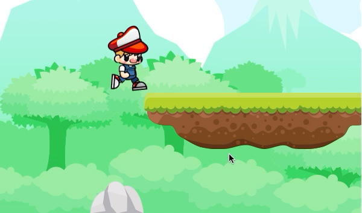
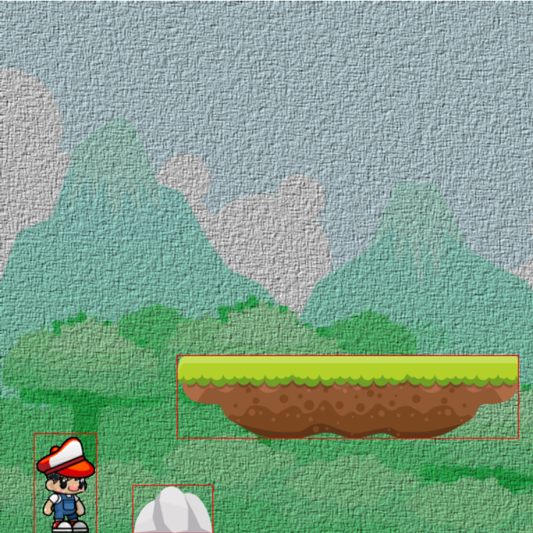
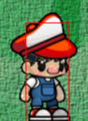

## Collision from below

At the moment, if RHB collides with the platform, he is set on the top, 
which is great for landing but not so great if he comes from beneath the platform. 

If you were to comment out the collision with the stone right now and run straight ahead, 
you'd actually find yourself suddenly pop up onto the platform! 

Why? 
Because RHB's head actually bumps into the bottom of the platform, and that collision 
causes the land_on event to fire. 

Instead of banging his head and falling over, he teleports onto the platform!

We need to have special collision detection here. RHB can only land on the platform 
if he comes from above it; otherwise, it's game over. 

Fortunately, this can be handled in the update function with two small changes 
to the way we check collisions. 

Collisions with the platform where RedHatBoy is above the platform means landing; 
otherwise, it's the same as hitting a stone, and you get knocked out. 
You also need to be descending; otherwise, you'll get this weird effect 
where you stick to the platform while still going up in your jump. 

Let's see that change:

```rust
// src/game.rs

#[async_trait(?Send)]
impl Game for WalkTheDog {
    ...
       fn update(&mut self, keystate: &KeyState) {
             walk.boy.update();

            // land
            if walk.boy
                   .bounding_box()
                   .intersects(&walk.platform.bounding_box())
            {
                // moving down              and above the platform
                if walk.boy.velocity_y() > 0 && walk.boy.pos_y() < walk.platform.position.y {
                    walk.boy.land_on(walk.platform.bounding_box().y);
                } else {
                    walk.boy.knock_out();
                }
            }

    

```

The changes are to check whether the RedHatBoy velocity, in `y`, is greater than 0 and,
therefore, RHB is moving down. We also check whether the position in y is less than the
top of the platform's y position. This means that the boy is above the platform, so he's
landing on it; otherwise, the boy has crashed into it, and we knock him out. 

The `pos_y` and `velocity_y` functions don't exist yet, so we'll add those to RedHatBoy, 
as shown here:

```rust
// src/game.rs


impl RedHatBoy {
    ...
    fn pos_y(&self) -> i16 {
        self.state_machine.context().position.y
    }

    pub fn velocity_y(&self) -> i16 {
        self.state_machine.context().velocity.y
    }
    ...
}

```

Also make velocity public

```rust
// src/game.rs

    #[derive(Copy, Clone)]
    pub struct RedHatBoyContext {
        pub frame: u8,
        pub position: Point,
        pub velocity: Point,
    }
```

It's a little tricky to get the `y` values for `RedHatBoy` because they are actually 
on `RedHatBoyContext`, but we are able to pull it off here and wrap them in a getter for
convenience.

With that, RHB can finally run, jump over stones, land on platforms, and fall off them.
However, you've probably noticed that the collisions are really crude. He crashes into
the bottom of the platform easily because the transparent parts of the images collide.
He also can walk past the edge of the platform, again because of the transparent parts of
the image:



Let's spend a little time tweaking our bounding boxes to deal with the transparency.

### Transparency in bounding boxes

The problem with our bounding boxes is that we're using the image dimensions as the
bounding box. That means we'll have a lot of extra space around our characters for our
bounding boxes. In this screenshot, I've used the draw_rect method from earlier in this
chapter to show the bounding boxes for all three objects in our scene:



The platform has a lot of white space in the bounding box, particularly at the lower-left
and lower-right corners. RHB also has white space near the corners of his hat. 

When we turn off the collision checks on the stone and try to walk under the platform, 
RHB "collides" with the lower-left corner of the platform well before he actually hits it.

The white space around RHB's feet is a problem too; they are what cause the landing
on air effect. 
The far-right edge of his bounding box intersects with the platform, so he lands 
before he's really in the right position. 

If you could see him walk off the edge of the platform, you'd see that it has 
the same problem when he walks off. He takes several steps in mid-air before he begins to fall. 

We'll start by dealing with RHB's bounding box to make landing and falling off the platform 
look a little more realistic.

#### Fixing the game to fit

There are algorithms we can use to make the bounding box better match the actual pixels
in the image, but ultimately, none of them are necessary. 

Spend a little time with most platformers and you'll see that the collisions aren't perfect, 
and 99% of the time, it's just fine. 

After spending a little time "researching" by playing video games, I determined that
if we simply make the box only as wide as the feet, he develops a much more realistic
landing. 

This is a little counter-intuitive. If we narrow the box, his arm and hat will stick
out past the edge of the box; we'll miss collisions! Does this matter?


The answer is, "maybe." Bounding boxes and collision detection are not just mathematical
problems. They are also game design problems. Making the bounding box wrap just
around the feet felt right to me when playing the game. Maybe when you play it, that will
feel too hard when you land on a platform or the hand not colliding will bother you, so
change the box! It's not written in stone.

After experimenting, I found that I wanted to shorten the box as well so that RHB couldn't
be knocked out by grazing his hat. 

To mimic that, we can start by renaming `bounding_box` to `destination_box`, 
because that represents where the sprite is rendered to.

```rust
// src/game.rs

impl RedHatBoy {
    ...

    //fn bounding_box(&self) ->Rect {
    fn destination_box(&self) -> Rect {
        let platform = self
                        .sheet
                        .frames
                        .get("13.png")
                        .expect("13.png does not exist");
    ....
```

 
It needs to be at the position of RedHatBoy in the game but with the width and height of
the source image; otherwise, the image will appear squished. 

Then, we can re-implement the RedHatBoy bounding box, like so:

```rust
// src/game.rs

impl RedHatBoy {
    ...

    fn destination_box(&self) -> Rect {
        ...
    }

    fn bounding_box(&self) -> Rect {
        const X_OFFSET: f32 = 18.0;
        const Y_OFFSET: f32 = 14.0;
        const WIDTH_OFFSET: f32 = 28.0;
        let mut bounding_box = self.destination_box();
        bounding_box.x += X_OFFSET;
        bounding_box.width -= WIDTH_OFFSET;
        bounding_box.y += Y_OFFSET;
        bounding_box.height -= Y_OFFSET;
        bounding_box
    }
```

We start with the original dimensions of the image, `destination_box`, and simply
shrink it by some offsets. I chose the numbers by using the high-tech system of picking
numbers and looking at them. This gave me a bounding box that looked natural jumping
and falling off the cliff while not being so small that RHB never hits anything.

If you did a global find and replace on `bounding_box` and changed it to
`destination_box` , then the collision detection is incorrect. We need to use
`bounding_box` for checking collisions and `destination_box` for drawing.

        Drawing should already be complete; 

        You'll need to go into the update method in
        WalkTheDog and make sure that every **intersects** 
        call is on the bounding_box, not destination_box .


```rust
// src/game.rs


#[async_trait(?Send)]
impl Game for WalkTheDog {
    ...

    fn update(&mut self, keystate: &KeyState) {
        if let WalkTheDog::Loaded(walk) = self {
            ...
            walk.boy.update();

            // land
            if walk.boy
                   .destination_box()
                   .intersects(&walk.platform.bounding_box())
            {
                //walk.boy.land_on(walk.platform.destination_box().y);
                if walk.boy.velocity_y() > 0 && walk.boy.pos_y() < walk.platform.position.y {
                    walk.boy.land_on(walk.platform.destination_box().y);
                } else {
                    walk.boy.knock_out();
                }
            }

            // knock_out
            if walk.boy
                   .destination_box()
                   .intersects(walk.stone.bounding_box())
            {
                walk.boy.knock_out();
            }
        }//^-- if let
    }//^-- fn update
```

With the new bounding_box method and a properly drawn image, you get a bounding
box that looks like this for RHB:



You can see that it's a lot smaller than the image, which makes the game look better and
play a little more forgiving. He lands on and falls off the platform much more accurately,
without a hovering effect. You also might find it easier to jump the stone now because the
transparent part of RHB doesn't crash into the rock.

That leaves us with the white space around the edges of the platform. We can shrink the
bounding box for it, but that would cause the player to fall through the top of the platform
when he lands on the edges. The platform is narrower on the bottom than the top, which
is a problem because we crash into the bottom and land on the top. 

What we really want to do is take the platform and make it into multiple bounding boxes.

#### Subdividing bounding boxes

We're going to take the one bounding box that is currently used for the platform 
and divide it into several. This will dramatically reduce the amount of extra space 
in the boxes and improve our collision detection. 

We'll look at the platform, see the white space, and then try out a few versions
of the bounding boxes divided up until we find a solution we like. 

We can begin that process by making it possible for `Platform` to have more than one `bounding box`. 
We'll do that by, again, renaming `bounding_box` to `destination_box` 

```rust
// src/game.rs


    //fn bounding_box(&self) ->Rect {
    fn destination_box(&self) ->Rect {
        let platform = self
                        .sheet
                        .frames
                        .get("13.png")
                        .expect("13.png does not exist");
        
        Rect {
            x: self.position.x.into(),
            y: self.position.y.into(),
            width: (platform.frame.w * 3).into(),
            height: platform.frame.h.into(),
        }
    }//^-- destination_box
```


and then creating a new method to construct a vector of `bounding_boxes` from that original box, 
as shown here:

```rust
// src/game.rs

    // fn bounding_box(&self) -> Rect {
    fn bounding_boxes(&self) -> Vec<Rect> {
        const X_OFFSET: f32 = 60.0;
        const END_HEIGHT: f32 = 54.0;
        let destination_box = self.destination_box();

        let bounding_box_one = Rect {
            x: destination_box.x,
            y: destination_box.y,
            width: X_OFFSET,
            height: END_HEIGHT,
        };

        let bounding_box_two = Rect {
            x: destination_box.x + X_OFFSET,
            y: destination_box.y,
            width: destination_box.width - (X_OFFSET * 2.0),
            height: destination_box.height,
        };

        let bounding_box_three = Rect {
            x: destination_box.x + destination_box.width – X_OFFSET,
            y: destination_box.y,
            width: X_OFFSET,
            height: END_HEIGHT,
        };

        vec![bounding_box_one, bounding_box_two, bounding_box_three]
}//^-- fn bounding_boxes
```

In this method, we create three Rects, each meant to match the platform, starting from the
destination box of the platform. It's two small rectangles on the edges and one bigger one
in the middle. When we draw those boxes, it looks like this:


That's a lot less white space that you can collide with. 
You might wonder where the values for X_OFFSET and END_HEIGHT came from, 
and the truth is that I just drew the boxes and looked at them until I was happy. 
It's not fancy; it's just good enough.

Now that we're using a vector of bounding boxes instead of just one, we'll need to change
the logic in the `update` method of `WalkTheDog` to make sure that `RHB` can collide with
any of the boxes and make the code compile. That code is reproduced here:


```rust
// src/game.rs

#[async_trait(?Send)]
impl Game for WalkTheDog {
...
        fn update(&mut self, keystate: &KeyState) {
            ...
            
            walk.boy.update();

            // land
            for bounding_box in &walk.platform.bounding_boxes() {
                if walk.boy.bounding_box().intersects(bounding_box) {
                    if walk.boy.velocity_y() > 0 && walk.boy.pos_y() < walk.platform.position.y {
                        walk.boy.land_on(bounding_box.y);
                    } else {
                        walk.boy.knock_out();
                    }
                }
            }

            // knock_out
            if walk.boy
                ...

```

also update draw_rect for Platform

```rust
// src/game.rs

    fn draw_rect(&self, renderer: &Renderer){
        for bounding_box in self.bounding_boxes() {
            renderer.draw_rect(&bounding_box);
        }
    }
```

The change here is to loop through all the bounding boxes and check for a collision on any
box. There are only three boxes here, so we're not worried about checking all three every
time. If the computer can't count to three, you probably need a new computer.
If you temporarily comment out collisions with the stone again, you'll see that you can just
barely walk underneath the platform:


At this point, you might wonder whether this should be a collision. After all, his hat does
kind of scrape the bottom of the platform. It might be hard for the player to tell if they will
fit under the the platform. Can we find a workaround for this?

#### Game design through constants

As we've gone through this section, we've been introducing more and more constants for
values such as `FLOOR` and `PLAYER_HEIGHT`. Most of the time, we treat magic numbers
as "bad" in code because they lead to duplication and bugs. That's true, but for most of
the numbers we've been using, we haven't had duplication. No, in this situation, we can
use constants to both clarify what the numbers mean and use those for game design. 

We can then use game design to hide little quirks, such as our platform being at a height 
that barely clears the player.

We used `Point { x: 200, y: 400 }` as the location of Platform when we originally created it. 
Those were magic numbers – sorry about that. 
We actually know that the `y` value of 400 positions the platform at a pretty confusing location. 
If `y` was 370 , then you would need to go under it, and if it's 420, you need to go over it. 

We can create three constants for that and set up the position.
The platform is a little to the right in this screenshot. I wanted to
be able to jump over the rock and then jump onto the platform. It's impossible to do that
with the way we constructed it originally, so I moved the platform to the right. I created
a constant named `FIRST_PLATFORM` for the `x` location of the platform, set it to 370, 
and then set the `x` position of Platform to that. 

That change is shown here:

```rust
// src/game.rs

const LOW_PLATFORM: i16 = 420;
const HIGH_PLATFORM: i16 = 375;

#[async_trait(?Send)]
impl Game for WalkTheDog {

    async fn initialize(&self) -> Result<Box<dyn Game>> {
        match self {
            WalkTheDog::Loading => {
                let sheet = browser::fetch_json("rhb.json").await?.into_serde()?;
                ...
                let platform_sheet = browser::fetch_json("tiles.json").await?;

                let platform = Platform::new(
                    platform_sheet.into_serde::<Sheet>()?,
                    engine::load_image("tiles.png").await?,
                    Point {
                        x: FIRST_PLATFORM, //x: 370,
                        y: LOW_PLATFORM,   //y: 420,
                    },
                );
                ...
```


I also found it nearly impossible to actually just jump the stone with the user's
combination of speed and gravity. Even after narrowing RHB's collision box, he jumps
high but not very far. Fortunately, that was very tweakable with constants – by simply
upping RUNNING_SPEED from 3 to 4 , he moved quickly enough to make jumping the
rock easy.

As we're designing our endless runner, we're going to find that we can hide any
imperfections in collisions through game design. You'll constantly need to tweak values
such as the speed of the player, bounding box heights, and obstacle locations. 

The more of the game you can encode into constants, the easier that will be.


---------------------

```rust
// src/


```


