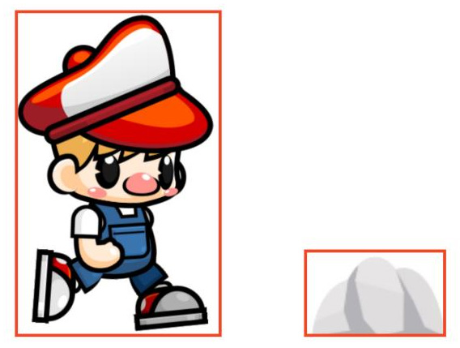
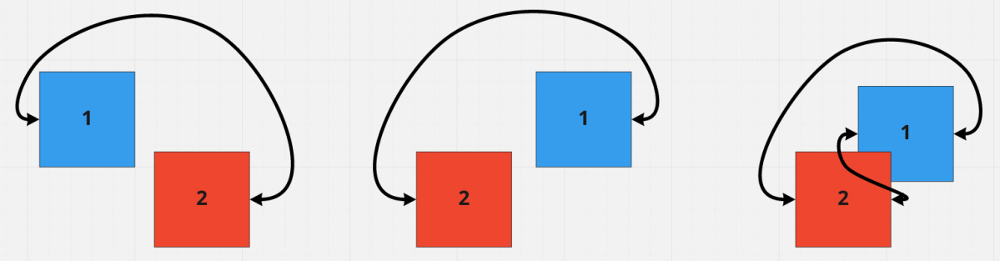
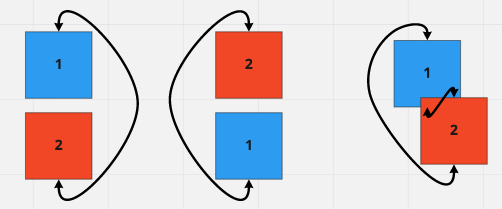
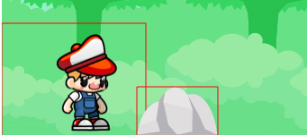

# Collision Detection

## Creating a real scene

### Adding the background

Right now, our game can only render images from a sprite sheet, which we can use for
a background, but that's overkill for one image. Instead, we'll add a new struct
that draws a simple image from a .png file. Then, we'll add that to the draw and
initialize functions in WalkTheDog :

TODO:

1. Create an Image struct.
2. Update the Image
3. Load the image
4. Modify WalkTheDog enum to load 
5. Add a Walk struct
6. Initialize Game with the Walk struct
7. Draw background

#### Create an Image struct.

We can work bottom-up for these changes, adding code to the engine and then
integrating it into the game. Our Image struct will use a lot of the same code
that we wrote in Chapter 2, Drawing Sprites, but with a simpler setup because we
won't be using a sheet. 

All of this code should go into the `engine` module.

Start with a struct holding HtmlImageElement :

```rust 
// src/engine

pub struct Image {
    element: HtmlImageElement,
    position: Point,
}

impl Image {
    pub fn new(element: HtmlImageElement, position: Point) -> Self {
        Self { element, position }
    }
}
```

The `Image` struct holds the image element, presumably loaded via the `load_image` function, 
and its position in the scene. `Image` will also need a draw function, but there's no simple
way to draw the entire image as it is in `Renderer`. 
That will need a new method:

```rust 
// src/engine

impl Renderer {
    ...
    pub fn draw_entire_image(&self, image: &HtmlImageElement, position: &Point) {
        self.context
            .draw_image_with_html_image_element(image, 
                                                position.x.into(), 
                                                position.y.into())
            .expect("Drawing is throwing exceptions! Unrecoverable error.");
    }
}
```

This function is very similar to the draw_image function we wrote earlier, 
but it's using the simpler version of the JavaScript drawImage function 
that only takes an image and a position.

To use this method, you'll need to be aware of how large the image you're drawing is. 
If it's too big or too small, it will show up just as big or small as the source image.

#### Update the Image

Now that you've added a method to Renderer , go ahead and update the Image implementation 
to draw an image with it:

NOTE: Its Image not HtmlImageElement as in the book.

```rust 
// src/engine

impl Image{
    ...
    pub fn draw(&self, renderer: &Renderer) {
        renderer.draw_entire_image(&self.element,&self.position)
    }
}
```

Now that you can draw an image, let's load it.

#### Load the image

Load the background image `BG.png`. 
Where? In the `game` module, in the initialize function of WalkTheDog.

```rust 
// src/game.rs

#[async_trait(?Send)]
impl Game for WalkTheDog {
    async fn initialize(&self) -> Result<Box<dyn Game>> {
        match self {
            WalkTheDog::Loading => {
                let sheet = browser::fetch_json("../resources/pix/rhb.json").await?.into_serde()?;
                let rhb = RedHatBoy::new(sheet, engine::load_image("../resources/pix/rhb.png").await?);
                let background = engine::load_image("../resources/pix/BG.png").await?;
        ...
```

Our WalkTheDog enum only holds RedHatBoy , so we're going to have to restructure the code a little. 

While we could have the `WalkTheDog::Loaded` state hold a tuple of `RedHatBoy` and `Background`,
that's going to get real annoying, real fast.

#### Modify WalkTheDog enum

To do that, change enum from 

```rust 
// src/game.rs

pub enum WalkTheDog {
    Loading,
    Loaded(RedHatBoy),
}
```
to look like this:

```rust 
// src/game.rs

pub enum WalkTheDog {
    Loading,
    Loaded(Walk),
}
```

We'll have WalkTheDog represent our game, but I decided that RHB takes the dog
for "walks," so our level will be Walk . In a generic framework, I might call this a
"scene" or "level," but this is a specific game, so Walk should work.

#### Add a Walk struct 

The Walk struct will need to have the RHB and the background, so go ahead and
add that:
```rust
// src/game.rs

pub struct Walk {
    boy: RedHatBoy,
    background: Image,
}
```

Make sure you've imported Image from the engine module. 

```rust
// src/game.rs

use crate::engine::Image;
...

pub struct Walk {
    boy: RedHatBoy,
    background: Image,
}

pub enum WalkTheDog {
    Loading,
    Loaded(Walk),
}
...
```

Now, you can work your way down the game module and follow the compiler errors. 
In the initialize function for WalkTheDog, 
you should see an error for " expected struct `Walk`, found struct `RedHatBoy`".

#### Initialize Game with the Walk struct

Creating `Walk` with the `background` we already loaded and setting it in
`WalkTheDog::Loaded` that's returned. This will look as follows:

```rust
// src/game.rs

impl Game for WalkTheDog {
    async fn initialize(&mut self) -> Result<Box<dyn Game>> {
        ...
        Ok(Box::new( WalkTheDog::Loaded( 
                            Walk { boy: rhb,
                                   background: Image::new( background, Point {x: 0, y: 0 }),
                            })
        ))
    }
...
}
```

This will create Walk with a boy and background positioned at the upper-left corner, 
but you should still have several compiler errors in the update method of `WalkTheDog` 
because those all assume that `WalkTheDog::Loaded` contains `RedHatBoy`. 

Each of those can be changed in the exact same way. The first looks like this:

```rust
// src/game.rs

impl Game for WalkTheDog {
...
fn update(&mut self, keystate: &KeyState) {
    //if let WalkTheDog::Loaded(rhb) = self {
    if let WalkTheDog::Loaded(walk) = self {
        if keystate.is_pressed("ArrowRight") {
            //walk.run_right();
            walk.boy.run_right();
        }
...
```


The if let WalkTheDog::Loaded line is unchanged, except now the variable
name is walk instead of rhb . Then, we call run_right on boy but via the
walk structure. You could argue that we should add methods to Walk instead
of delegating to boy , but we'll hold off on that for now. After all, walk.run_
right() doesn't really make sense. After fixing all the similar compiler errors in
update , you can also fix a similar error in draw , like so:

```rust
// src/game.rs

impl Game for WalkTheDog {
    ...
    fn draw(&self, renderer: &Renderer) {
        renderer.clear(&Rect {
            x: 0.0,
            y: 0.0,
            width: 600.0,
            height: 600.0,
        });

        if let WalkTheDog::Loaded(walk) = self {
            walk.boy.draw(renderer);
        }
    }
    ...
```

#### Draw background

Next, go ahead and draw the background for our game. Drawing the background
is a matter of using our new draw function, so let's add that right before the walk.
boy.draw function call, as shown here:

```rust
// src/game.rs

impl Game for WalkTheDog {
    ...
    fn draw(&self, renderer: &Renderer) {
    ...
        if let WalkTheDog::Loaded(walk) = self {
            walk.background.draw(renderer);
            walk.boy.draw(renderer);
        }
...
```

After doing that, you should see RHB standing in front of the background.

### Adding an obstacle

Our new Image object means we won't need much code to add an obstacle

Put Stone.png in your pix resources folder, then can add it to
`Walk` in the same way you added `Background`, like so:

```rust
// src/game.rs

struct Walk {
    boy: RedHatBoy,
    background: Image,
    stone: Image,
}
```

That will start causing compiler errors again because Walk is created without
a stone. 

In initialize , go ahead and load the stone, just as you loaded the background,
as shown here:

```rust
// src/game.rs

impl Game for WalkTheDog {
    async fn initialize(&mut self) -> Result<Box<dyn Game>> {
        ...
        let background = engine::load_image("../resources/pix/BG.png").await?;
        let stone = engine::load_image("../resources/pix/Stone.png").await?;
        ...
```

Then, you need to take the stone that we just loaded and add it to Walk . We'll make
sure the stone is on the ground by taking the FLOOR value ( 600 ) and subtracting
the height of the stone image, which happens to be 54 pixels. If we position the
stone at a y position of 546 , it should be sitting right on the ground. Here's the
update for creating Walk :       


```rust
// src/game.rs

impl Game for WalkTheDog { 
    async fn initialize(&mut self) -> Result<Box<dyn Game>> {
        ...
           let walk = Walk {   boy: rhb, 
                               background: Image::new(background, Point {x:0, y:0}),
                               stone: Image::new(stone, Point { x: 150, y: 546 })
                            };
            Ok(Box::new(WalkTheDog::Loaded(walk)))
        

```

The stone is 150 pixels to the right, so it will be in front of RHB. 
Finally, draw the stone using the `draw` method. 
That addition is as follows:


```rust
// src/game.rs

impl Game for WalkTheDog {
    ...
    fn draw(&self, renderer: &Renderer) {
    if let WalkTheDog::Loaded(walk) = self {
        ...
        if let WalkTheDog::Loaded(walk) = self {
            walk.background.draw(renderer);
            walk.boy.draw(renderer);
            walk.stone.draw(renderer);
        }
```

While we've learned how to add new objects into the game, and
drawn them for a more interactive experience, the game doesn't have any challenges yet.
We want the boy to crash into the stone and fall over, ending the game. To do that, we'll
need to learn a little about bounding boxes and collision detection, so let's do that in the
next section.

## Axis-aligned bounding boxes

Checking whether two objects in our game have collided can, theoretically, be done 
by checking every pixel in every object and seeing whether they share a location. 
That logic, in addition to being very complicated to write, would be computationally 
extremely expensive. 

We need to run at 60 frames a second and can't spend our precious processing power 
trying to get that kind of perfection – not if we want the game to be fun, anyway.

Fortunately, we can use a simplification that will be close enough to fool our silly eyes,
the same way we can't tell that animation is really just a series of still images. 

That simplification is called the bounding box.

A bounding box is just a rectangle we'll use for collisions, instead of checking each pixel
on the sprite. You can think of every sprite having a box around it.



These boxes aren't actually drawn; they only exist in the memory of the game, except
when you want to debug them. When you use boxes, you only have to check for the values
of the box – `top (y)`, `left (x)`, `right (x + width)`, and `bottom (y + height)`. 
It makes for a much faster comparison. 

Let's talk in a little more detail about how to detect when two boxes intersect.

NOTE:
    
    The term "axis-aligned" means is that the boxes aren't rotated. 
    Y will be up and down, X left to right, and always aligned with
    the game's coordinate system.

### Collision

In order to detect whether two boxes collide or overlap, they will exist 
in the same 2D coordinate space we've been using since the beginning of this book. 
They may not be visible, but they are there, sitting where the stone is or running along with RHB. 

They'll need a position in x and y, just like a sprite already has, 
and also a width and height. 
When we check whether two boxes are colliding, 
we check in both the x and y axes. 

#### Horizontal Axis

Let's first look at how you can tell whether two boxes intersect in the x axis. 
Given there are two boxes, box 1 intersects box 2 
if the left side (or x position) of box 1 is less than the right side of box 2 
but the right side of box 1 is greater than the left side of box 2.



The preceding figure shows three sets of two boxes that could potentially collide, in
a space where x increases as you move to the right, just like our canvas. The first two
comparisons don't collide, but the third does.

Take a look at the first comparison where box 1 is to the left of box 2, with a gap in
between them. 
As you can see, the left side of box 1 is well to the left of the right side of box 2, 
as shown by the arrows. 
This passes the first condition for collision – the left side of box 1 must be less 
than the right side of box 2. 
However, the right side of box 1 is to the left of box 2's 
left side, which violates our second condition. 

To collide, the right side of box 1 must be greater than (to the right) of the left side of box 2, 
so these two boxes don't collide.

In the second comparison, box 1 has been moved to the right of box 2, again without overlapping. 
Box 1's right side is now to the right of box 2's left side, so they meet the second condition of colliding, 
but the left side of box 1 is now also to the right of box 2's right side, 
so the boxes don't meet the first condition and still don't collide.

Finally, in the third comparison, the left side of box 1 is again to the right of box 2's right side, 
but the left side of box 1 is to the left of box 2's right side. 

These two boxes collide. 

Box 1 and box 2 have overlapping x values, so they collide.

If images aren't your style, it can also help to look at real numbers to see how this
algorithm works. 
Assuming box 1 and box 2 are both 10 x 10, squares we can form a table, like this:


In every row of this table – that is, every example set of coordinates – box 2 is in the same
place. 
There are actually four examples here. 

- In the first row, box 1 is completely to the left of box 2. 
- In the second, the boxes collide because box 1's right edge hits box 2's left edge.
- In the third, they collide because box 1's left edge is hitting box 2's right edge. 
- Finally, in the fourth row, box 1 is not completely to the right of box 2. 

The values hold the same properties of the images; 
either the left edge or right edge of the first box 
is between the left and right edge of the second box. 

This long explanation leads to the following short
pseudocode:


```
if (box_one.x < box_two.right) &&
   (box_one.right > box_two.x) {
        log!("Collision!");
}
```

#### Vertical Axis

This satisfies two of the conditions I mentioned at the beginning, 
but what about the vertical axis (y)? 

That works in a similar way, only instead of using the left and right sides,
we use the `top` and `bottom` values respectively. 

The top of box 1 must be above, which means less than, the bottom of box 2. 
The bottom of box 1 must be below the top of box 2. 

If both of those are true, the boxes collide. 

Remember that y goes up as we go down the screen in our coordinate space:



Let's take a moment to work through these three comparisons, just as we did before. 
For the first comparison, the top of box 1 is above the bottom of box 2, 
but the bottom of box 1 is also above the top of box 2, so they do not overlap.

In the second case, box 1 is completely below box 2, with no collision. 
The bottom of box 1 is below the top of box 2, which must be true for a collision, 
but the top of box 1 is also below the bottom of box 2, 
so our first rule of vertical collisions does not hold.

In the third comparison, the top of box 1 is above the bottom of box 2, 
and the bottom of box 1 is below the top of box 2, 
so we have a collision. 

This means we can extend our pseudocode to look like the following:

```
    //horizontal axis
if  (box_one.x < box_two.right) &&
    (box_one.right > box_two.x) &&
    //vertical axis
    (box_one.y < box_two.bottom) &&
    (box_one.bottom > box_two.y) {
        log!("Collision!");
}
```


Those are the four things that must be true to get a collision. 
So, now that we know our collisions, 
we can apply bounding boxes to RHB and a stone so that they can collide.

Unfortunately, a naive approach will lead to really difficult collisions 
and a nearly impossible game. 

That problem can be summarized in one word – **transparency**.

#### transparency

Consider the bounding boxes in red for both RHB and the stone:



These bounding boxes were created by using the size of the entire sprite after it was
loaded, using the width and height properties of HTMLImageElement. 
As you can see, the boxes are far larger than their corresponding sprites, 
especially the one for RHB. 
This is because the sprite has transparency, which we do not want to include 
in our bounding boxes. 

Right now, the boxes collide, and RHB would be knocked over by the stone well before touching it. 
That's not what we want!

This is an example of the primary debugging technique for bounding box collisions –
drawing the boxes so that you can see what's wrong. 
In this case, RHB's box is just way too big. 
It should be the minimum size required to contain the entire image, 
and the bug this is revealing is that the sprite sheet we used in Chapter 2, Drawing Sprites, 
contains a lot of transparency. 
We'll need to fix that before RHB will properly collide with the stone, 
so let's start trimming the sprite sheet.

### Trimming the sprite sheet

In order to have RHB crash into a stone, we're going to have to deal with the transparency.

Let's take a look at the raw `.png` file that RHB is coming from. 
A portion of the image is shown in Figure 5.8, as follows:


This is two frames of the idle animation, with black lines showing the image borders. 
As you can see, there is a ton of extra space in these images, so using a bounding box that's
the same size as the image won't work. 
That's the problem you see with the bounding boxes. We have two choices to fix it. 
The simplest, although annoying, would be to open our sprite sheet in a graphics editor 
and find out the actual pixels for the bounding boxes for each sprite. 
Then, we would store that in code or a separate file and use those bounding boxes. 
That's faster in development time, but it means loading a much larger image 
than is necessary and rendering a bunch of transparency for no reason. 
It's a big performance hit to avoid writing some code, but we might do that if we were in
a game jam and needed to finish the game in a hurry.

What we're going to do is use a trimmed sprite sheet, which has the transparency taken out. 
This will mean writing a little code to make sure the sprites still line up, 
but the memory savings alone (because of a smaller graphic file) will be worth it.

Our trimmed sprite sheet will look like the following (this is a segment):


Note that while the white space is trimmed, it's not all removed. 

That's because each rectangle is still the same size across the entire sheet. 
Look at how the knocked-out version of RHB takes up the entire rectangle horizontally 
but the idle RHB takes it up vertically. 
This means that we'll have to account for some transparency with our bounding
box, but fortunately, our sprite sheet JSON will also have that data. 
We'll also need to make sure that the sprites are lined up properly 
so that the animations don't jerk around the screen. 

Fortunately, the JSON provides that data as well.

Note::
    
        All the sprite sheets used here are generated with a tool called TexturePacker.
        That includes the JSON that goes along with the graphics. While you can
        make your own texture maps, why would you? 
        [TexturePacker](https://www.codeandweb.com/texturepacker) .
        TexturePacker has built-in tools for trimming a sprite sheet and exporting the
        data we need to make them useful in our game.

The trimmed version of the sprite sheet data file will have a little more information to go
along with what we used in Chapter 2, Drawing Sprites. 

Here's an example of the first two idle sprites from the new JSON file:

```json
"Idle (1).png":
{
    "frame": {"x":117,"y":122,"w":71,"h":115},
    "rotated": false,
    "trimmed": true,
    "spriteSourceSize": {"x":58,"y":8,"w":71,"h":115},
    "sourceSize": {"w":160,"h":136}
},
"Idle (2).png":
{
    "frame": {"x":234,"y":122,"w":71,"h":115},
    "rotated": false,
    "trimmed": true,
    "spriteSourceSize": {"x":58,"y":8,"w":71,"h":115},
    "sourceSize": {"w":160,"h":136}
},
```

Both frames have the frame data that we used previously to cut out our sprite, but they
also include a spriteSourceSize field. That field contains the bounding box for
the non-transparent portion of the sprite. 
In other words, the first two idle frames had their sprite start with 57 transparent pixels 
on the left and 8 on top. 
This information is vital to line up the trimmed sprites, which both start at 0,0. 
Failing to use this will result in an animation that jumps all over the page and looks terrible. 

Fortunately, this is rectified by taking the position of the sprite 
and adding the spriteSourceSize x and y coordinates to it. 
This will result in the sprite not looking like it's in the right place intuitively – that is, 
when we position the sprite at 0, it will show up 58 pixels to the right,
but as long as we also account for spriteSourceSize when doing collision detection,
it won't matter. 
Once we've accounted for spriteSourceSize , our bounding boxes will be tight around our sprite sheet, 
with minimal transparency started:


Note:
    
    If you want to draw your own bounding boxes for debugging, and
    I recommend that you do, you can add a draw_rect function to
    Renderer and draw the rectangle on the context.


```rust
// src/engine.rs

impl Renderer {
    ...

    pub fn draw_rect(&self, bounding_box: &Rect) {
        self.context.set_stroke_style(&JsValue::from_str("#FF0000"));
        self.context.begin_path();
        self.context.rect(
            bounding_box.x.into(),
            bounding_box.y.into(),
            bounding_box.width.into(),
            bounding_box.height.into(),
        );
        self.context.stroke();
    }
    ...
}
```

then

```rust
// src/game.rs

    fn draw_rect(&self, renderer: &Renderer){
        let frame_name = format!(
            "{} ({}).png",
            self.state_machine.frame_name(),
            (self.state_machine.context().frame / 3) + 1
        );
        let sprite = self
            .sprite_sheet
            .frames
            .get(&frame_name)
            .expect("Cell not found");

        renderer.draw_rect(
            &Rect {
                x: (self.state_machine.context().position.x
                + sprite.sprite_source_size.x as i16).into(),
                y: (self.state_machine.context().position.y
                + sprite.sprite_source_size.y as i16).into(),
                width: sprite.frame.w.into(),
                height: sprite.frame.h.into(),
            });   
    }
```

then 

```rust
// src/game.rs


#[async_trait(?Send)]
impl Game for WalkTheDog {
    ...
    fn draw(&self, renderer: &Renderer) {
        ...
        if let WalkTheDog::Loaded(walk) = self {
            walk.background.draw(renderer);
            walk.boy.draw(renderer);
            walk.boy.draw_rect(renderer);
            walk.stone.draw(renderer);
        }

```

`stone` is an Image so  we can draw_rect in engine


```rust
// src/engine.rs

pub struct Image {
    element: HtmlImageElement,
    position: Point,
}

impl Image {
    ...
    pub fn draw_rect(&self, renderer: &Renderer) {
        renderer.draw_rect( &Rect{ x:self.position.x.into(), 
                                   y: self.position.y.into(), 
                                   width: self.element.width() as f32, 
                                   height: self.element.height() as f32}
        );
    }

```
Now we can also add

```rust
// src/game.rs

#[async_trait(?Send)]
impl Game for WalkTheDog {
    ...
    fn draw(&self, renderer: &Renderer) {
        ...
        walk.boy.draw_rect(renderer);
        walk.stone.draw(renderer);
        walk.stone.draw_rect(renderer);
```


With these new, corrected bounding boxes, RHB and the stone don't collide, and jumping
over the stone safely is eventually possible. In the next section, we'll start by adding the
new trimmed sprite sheet.

### Adding the trimmed sheet

In the sprite_sheets directory of the assets folder, you can find new versions of
the sprite sheet named `rhb_trimmed.png` and `rhb_trimmed.json` . Copy those over
to static , but make sure you rename the files `rhb.png` and `rhb.json` respectively.

NOTE:

    The github just replaces the old rhb for the new ones. 
    We'll keep the names stay in sync with the code not the book.

Start your server if it isn't already running, and you should see RHB bouncing around
on screen because the sprites in the sheet aren't lined up correctly anymore. He'll also be
hovering a little bit over the ground:


Our first priority will be to fix up his animation so that it isn't so jerky. This is why we
spent so much time discussing spriteSourceSize earlier – so that we can fix his
animation. First, we'll add that field to Cell , which you may or may not recall is in the
engine module, as shown in the following code snippet:

```rust
// src/engine.rs

/*
#[derive(Deserialize, Clone)]
pub struct Cell {
    pub frame: SheetRect,
}
*/

#[derive(Deserialize, Clone)]
#[serde(rename_all = "camelCase")]
pub struct Cell {
    pub frame: SheetRect,
    pub sprite_source_size: SheetRect,
}

```

The changes are the additions of the `#[serde(rename_all)]` directive 
and a `sprite_source_size` field. 
While `spriteSourceSize` is the name in the JSON, this is Rust, 
and in Rust, we use snake case for variable names, 
which is why we use the serde(rename_all) directive. rename_all = "camelCase" 
may seem backward because we're actually renaming to snake case, 
but that's because the directive refers to serialization, not deserialization. 
If we were to write out this structure to a JSON file, we'd want to rename 
any variables to be camelCase, which means to deserialize, we do the opposite. 

Thanks to the work we did earlier, `sprite_source_size` will be loaded up from the new JSON file, 
so next, we'll need to adjust the drawing so that the animation lines up again.

In the game module and the RedHatBoy implementation, we'll change the draw
function slightly to account for the trimming. It looks like the following:

```rust
// src/game.rs

impl RedHatBoy {
    ...
    fn draw(&self, renderer: &Renderer) {
        ...
        renderer.draw_image( 
            &self.image,
            &Rect {
            ...
            },
            &Rect {
                //x: self.state_machine.context().position.x.into(),
                //y: self.state_machine.context().position.y.into(),

                x: (self.state_machine.context().position.x
                + sprite.sprite_source_size.x as i16).into(),
                y: (self.state_machine.context().position.y
                + sprite.sprite_source_size.y as i16).into(),

                width: sprite.frame.w.into(),
                height: sprite.frame.h.into(),
            },
        );
    }
```


We've reproduced the entire RedHatBoy::draw call for context, 
but only two lines have changed.

Remember that the `draw` call takes two rectangles – the source, which is
unchanged, and the destination, which is what we changed. 
Both the x and y coordinates are adjusted by `sprite_source_size` 
and its respective coordinates. 
The cast to `i16` might make you nervous because it could cause math errors 
if the `x` or `y` position in the sprite sheet is over `2` `15`, 
but that would be a very strange sheet. 

Finally, the into call is on the computed result, to turn `i16` back into `f32` 
for the Rect struct.
 
After making those changes, you should see the animation play correctly, 
and RHB should return to where he was originally, next to the stone:

If you're drawing the bounding boxes with draw_rect, 
make sure it's using the same bounding box as the images. 

Note how the bounding boxes don't overlap anymore. 
Still, it's very close, and RHB does hover over the ground a little bit. 
So, let's adjust his starting position just a bit. 

At the top of the `red_hat_boy_states` module, 
we are going to change one constant and add a new one, as follows:

```rust
// src/game.rs

mod red_hat_boy_states {
    use crate::engine::Point;

const FLOOR: i16 = 479;
const STARTING_POINT: i16 = -20;

```

Previously, FLOOR was 475, but let's push RHB down just a few pixels. 
We'll also give RHB a negative x position, to give a little room between him and the stone. 

Remember that RHB is adjusted back to the right to account for animation, 
so he won't actually be drawn off screen. 

Next, we'll modify the `RedHatBoyState<Idle>` implementation,
specifically the new function, to move RHB's starting point. 
`x: STARTING_POINT`

That change is shown here:

```rust
// src/game.rs


    #[derive(Copy, Clone)]
    pub struct Idle;

    impl RedHatBoyState<Idle> {
        pub fn new() -> Self {
            RedHatBoyState {
                context: RedHatBoyContext {
                    frame: 0,
                    position: Point { x: STARTING_POINT, y: FLOOR, },
                    velocity: Point { x: 0, y: 0 },
                },
                _state: Idle {},
            }
        }
```

The bounding boxes are correct in our images, but we're not actually using them yet.
That's why if you push the right arrow, RHB will still start running and pass right behind
the stone. It's time to give the stone and RHB proper axis-aligned bounding boxes, rather
than just drawing them, and then use them to knock RHB right over. What fun!


