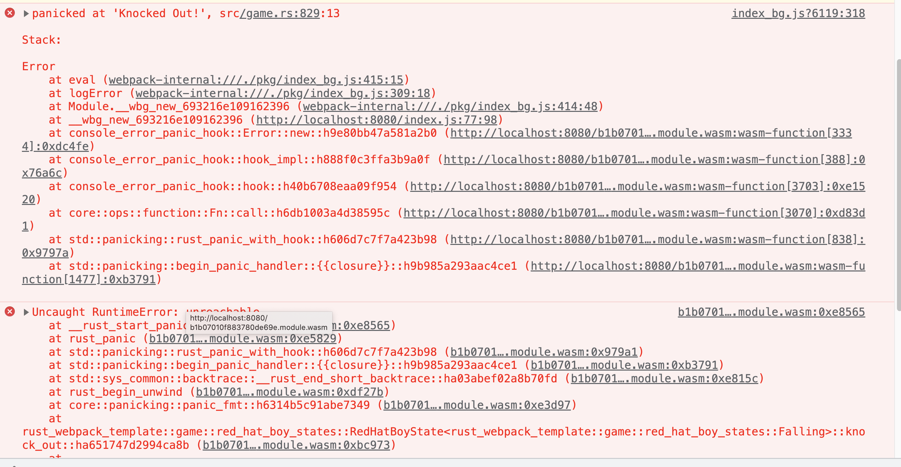
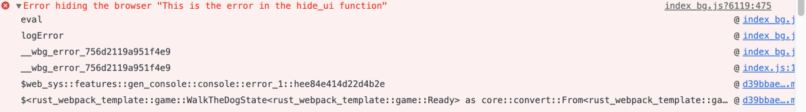

# Testing and Advanced Tricks

## Debugging the game

### Debugger

To debug a traditional program, be it in Java, C#, or C++, we must set breakpoints and
step through the code. In JavaScript, we can type the word debugger to set a breakpoint,
but although WebAssembly runs in the browser, it isn't JavaScript. 

So, how do we debug it?

There's a lot of conflicting information about debugging with WebAssembly. 
How do you debug WebAssembly? 

Well, according to the official Rust WebAssembly documentation, it's simple – you can't!


Unfortunately, the debugging story for WebAssembly is still immature.
On most Unix systems, DWARF is used to encode the information that a
debugger needs to provide source-level inspection of a running program.
There is an alternative format that encodes similar information on
Windows. Currently, there is no equivalent for WebAssembly. Therefore,
debuggers currently provide limited utility, and we end up stepping through
raw WebAssembly instructions emitted by the compiler, rather than the
Rust source text we authored.

[SOURCE](https://rustwasm.github.io/docs/book/reference/debugging.html)

So, there you have it – no debugging, section over. That was easy.
Debbugers don't work yet. 

But it's not that simple.
Debuggers are still useful for inspecting the JavaScript that interacts with our WebAssembly, and inspecting raw wasm state.


And of course, you can debug your application – you just can't use your browser's developer tools 
to step through the Rust code in a debugger. 

The technology isn't there yet. But that doesn't mean we don't debug; 
it just means we'll take more of an old-school approach to debugging.


Earlier, I mentioned that when I write code, I typically write a lot of tests. I also typically
don't use a debugger very often. If we break our code into smaller chunks that can be
easily exercised by tests, a debugger is rarely required. 

That said, we didn't do that for this project, so we'll need a way to debug existing code. 

We'll start by logging, then getting stack traces, 
and finally using linters to prevent bugs before they happen.

Note::

    The reality is not as cut and dry as the Rust Wasm site would state. Chrome
    developer tools have added support for the DWARF debugging format to the
    browser, as detailed here: https://developer.chrome.com/blog/
    wasm-debugging-2020/ . This standard format, whose specification can
    be found at https://dwarfstd.org/ , unfortunately is not supported
    by wasm-bindgen at the time of writing. You can see progress on this
    issue here: https://github.com/rustwasm/wasm-bindgen/
    issues/2389 . By the time you read this book, the debugging tools may
    be modernized in Rust Wasm, as well as in browsers outside of Chrome, but
    for the time being, we must use more traditional tools such as println!
    and logging.
    

### Log versus error versus panic

If you've been following along and got confused at some point, then you've probably used
the `log!` macro we wrote in Chapter 3, Creating a Game Loop, to see what was going on.

If you have been doing that, congratulations! You've been debugging the same way I did
when I wrote the code originally. 

**Print line** debugging is still standard in many languages and it's pretty much 
the only form of debugging that's guaranteed to work anywhere. 

If you haven't done that, then it looks like this:


```rust
// src/game.rs

impl WalkTheDogStateMachine {

    fn update(self, keystate: &KeyState) -> Self {
        log!("Keystate is {:#?}", keystate);

        match self {
            WalkTheDogStateMachine::Ready(state) => state.update(keystate),
            WalkTheDogStateMachine::Walking(state) => state.update(keystate),
            WalkTheDogStateMachine::GameOver(state) => state.update(),
        }
    }

```

In the preceding example, we are logging `KeyState` on every tick through the `update` function. 
This isn't a great log because it's going to show an empty KeyState 60 times a second, 
but it's good enough for our purposes. 

However, there's one flaw in this log: `KeyState` doesn't implement the Debug trait. 
You can add it by adding the `derive(Debug)` annotation to the `KeyState` struct, like so:


```rust
// src/engine.rs


#[derive(Debug)]
pub struct KeyState {
    pressed_keys: HashMap<String, web_sys::KeyboardEvent>,
}

```


When you add this, the console will log all your key state changes, 
which will be useful if your keyboard input is broken:

> In general, any pub struct should use `#[derive(Debug)]`, 

but this isn't the default option since it could make compile times long on large projects. 
When in doubt, go ahead and use #[derive(Debug)]` and log the information. 

Now, maybe `log!` isn't noticeable enough for you, and you want the text to be bright, 
obvious, and red. 

For that, you'll need to use console.error in JavaScript and write a macro such as the log macro, 
which we already have in the browser module. 


```rust
// src/browser.rs

// It's a macro that allows you to log in to the console with log!
// using a syntax such as the format! function.
// Taken from https://rustwasm.github.io/book/game-of-life/debugging.html

macro_rules! log {
    ( $( $t:tt )* ) => {
        web_sys::console::log_1(&format!( $( $t )* ).into());
    }
}
```

This time the macro looks like this:

```rust
// src/browser.rs


macro_rules! error {
    ( $( $t:tt )* ) => {
        web_sys::console::error_1(&format!( $( $t )* ).into());
    }
}
```

This is the same as the log macro but uses the `error` function on the console object instead og `log`.
There are two advantages to the `error` function. 
The first is that it's red, 
while the other is that it also will show you the stack trace. 

Here's an example of error being called when
the player is knocked out in Chrome:


It's not the most readable stack trace in the world, but after seeing a few lines of
the `console::error_1` function, you can see that this `log` was called from
`WalkTheDogState<Walking>::end_game`. 
This log is really for true errors, as opposed to just informational logging, 
and this stack trace may not show up clearly in all browsers. 

You'll also want to be cautious with leaving this log in the production code 
as you may not want to expose this much information to a curious player. 

We'll want to make sure it's not in the production deployment, 
which we'll create in Chapter 10, Continuous Deployment.


Finally, if you want to make sure the program stops when an error occurs, we'll want to go
ahead and use the `panic!` macro. 

Some errors are recoverable but many are not, 
and we don't want our program to limp along in a broken state. 

In Chapter 1, Hello WebAssembly, we included the `console-error-panic-hook` crate 
so that if the program were to panic, we'd get a stack trace. 

Let's replace calling `error!` with calling `panic!` and see the difference:




Here, you can see it looks a little different, but the information is mostly the same. 
There is one thing at the very top where it says `src/game.rs:829`, which tells you exactly where
panic was called. 
In general, you will probably prefer to use panic compared to error if you need to have the error 
in your production code because that kind of error should be rare and fail fast. 

The error function is more useful during debugging, so you'll end up removing those.

There's another kind of error that we've been ignoring at times, and that's the warnings
and errors that are given to you by the compiler and linter. 

We can use the Rust ecosystem's tools to detect mistakes before we ever run the program. 
Let's look into that now.

### Linting and Clippy

One of the features that makes the Rust compiler great is that it has a `linter` built into it,
in addition to the warnings and errors it already provides. If you're unfamiliar, a linter
is a static code analysis tool that typically finds style errors and, potentially, logic errors
above and beyond what the compiler can find. The term comes from the lint you find on
clothing, so you can think of using a linter like rubbing a lint brush on your code. 

We've been getting some warnings from the compiler that we've been ignoring for a while now,
most of which look like this:

```
warning: unused `Result` that must be used
    --> src/game.rs:1032:9
     |
1032 |         browser::hide_ui();
     |         ^^^^^^^^^^^^^^^^^^
     |
     = note: this `Result` may be an `Err` variant, which should be handled
help: use `let _ = ...` to ignore the resulting value
     |
1032 |         let _ = browser::hide_ui();
     |         +++++++

```
These are all cases where an error could occur, but we probably don't want to crash if it
does, so panicking or calling `unwrap` isn't an option. 
Propagating the `Result` type is an option, but I don't think we want to prevent moving 
from one state to another if there's a small browser issue. 

So, instead, we'll use the error case to log here. 
You can see it at https://bit.ly/3q1936N in the sample source code. 
Let's modify the code so that we log any errors:

```rust
// src/game.rs

impl WalkTheDogState<GameOver> {
    ...
    fn new_game(self) -> WalkTheDogState<Ready> {
        //browser::hide_ui();
        if let Err(err) = browser::hide_ui() {
            error!("Error hiding the browser {:#?}", err);
        }

        WalkTheDogState {
            ...
```

Here, we have changed the `browser::hide_ui()` line to 
`if let Err(err) = browser::hide_ui()` and we log if an error occurs. 
We can see what that error log will look like by forcing `hide_ui` to return an error for a moment:




The stack trace is cut off in book form, but you can see that we got an error log 
with `Error hiding the browser` and then This is the error in the `hide_ui` function, 
which is the error message I forced into `hide_ui`. 
The stack trace also shows `game::Ready`, 
which would show you that you were transitioning into the `Ready` state 
if you had infinite room to show the entire message.

Every single warning that's being generated should be dealt with. Most of the warnings
are the same kind – that is, Result types where the Err variant is ignored. These can
be removed by handling the Err case with a log or by calling panic if the game should
truly crash at this time. 
For the most part, I've used the if let pattern but if `request_animation_frame` fails, 
then I just use unwrap. 
I don't see how the game could work if that's failing.

There is one more warning we've been ignoring that we should address, as shown here:

```
warning: method `draw_rect` is never used
   --> src/engine.rs:127:12
    |
106 | impl Image {
    | ---------- method in this implementation
...
127 |     pub fn draw_rect(&self, renderer: &Renderer) {
    |            ^^^^^^^^^
    |
    = note: `#[warn(dead_code)]` on by default

```

This warning is a little unique because we used this function for debugging. 
You may not want to draw rectangles in your game, but it's essential for debugging collision boxes, 
as we did in Chapter 5, Collision Detection, so we'll want it to be available. 

To keep it around, let's annotate it with the allow keyword, as suggested like so:

```rust
// src/engine.rs

impl Renderer {
    ...
    #[allow(dead_code)]
    pub fn draw_rect(&self, bounding_box: &Rect) {

...
```

There's one more tool we can use to see whether our code could be improved. 

If you've spent much time in the Rust ecosystem, then you've probably heard of `Clippy`, 
a popular Rust linter that will catch common Rust mistakes and improve your code, 
above and beyond those found by the compiler's defaults. 

It's installed as a Cargo component, so it's not added to your Cargo.toml file
but to the current system itself. Installation is simple, and you may have done it at some
point and forgotten about it, but if you haven't, it's one shell command:

```
$ rustup component add clippy
```

Once you've installed Clippy, you can run cargo clippy and see all the other ways we
wrote bad Rust code.

When I run `cargo clippy`, I get 17 warnings, but your number could be different,
depending on when you run it. 

Many of the other errors are about overusing clone and using into when it isn't
necessary. I highly recommend going through the code and fixing those, taking another
moment to understand why they were flagged. In Chapter 10, Continuous Deployment,
we'll add Clippy to our build process so that we don't have to keep putting up with
these errors.

#### Serializing and Deserializing Arbitrary Data Into and From JsValue with Serde

One major warning is the use of `into_serde()`. JsValue::into_serde() is deprecated! 

It's possible to pass arbitrary data from Rust to JavaScript by serializing it with Serde. 
But now we do it through the `serde-wasm-bindgen` crate or `gloo_utils`.

##### serde-wasm-bindgen

You first have to add it as a dependency in your Cargo.toml. You also need the serde crate, with the derive feature enabled, to allow your types to be serialized and deserialized with Serde.

```toml
# Cargo.toml
...

[dependencies]
...
serde = { version = "1.0", features = ["derive"] }
serde-wasm-bindgen = "0.4"
...
```

Derive the Serialize and Deserialize Traits

Add #[derive(Serialize, Deserialize)] to your type. All of your type's members must also be supported by Serde, i.e. their types must also implement the Serialize and Deserialize traits.

We don't have to change engine.rs
We only need `Deserialize` which we have already.

```rust
// src/engine.rs

...
//use serde::{Serialize, Deserialize};
use serde::Deserialize;
...

//#[derive(Serialize, Deserialize, Clone)]
#[derive(Deserialize, Clone)]
pub struct SheetRect {
    pub x: i16,
    pub y: i16,
    pub w: i16,
    pub h: i16,
}


#[derive(Deserialize, Clone)]
#[serde(rename_all = "camelCase")]
pub struct Cell {
    pub frame: SheetRect,
    pub sprite_source_size: SheetRect,
}

#[derive(Deserialize, Clone)]
pub struct Sheet {
    pub frames: HashMap<String, Cell>,
}


```

Send it to JavaScript with `serde_wasm_bindgen::to_value`.  
Receive it from JavaScript with `serde_wasm_bindgen::from_value`.

```rust
// src/game.rs

...
#[async_trait(?Send)]
impl Game for WalkTheDog {
    async fn initialize(&self) -> Result<Box<dyn Game>> {
        match self.machine {
            None => {         
                
                //let sheet = browser::fetch_json("../resources/pix/rhb.json").await?.into_serde()?;    
                //    
                let sheet = serde_wasm_bindgen::from_value(
                                browser::fetch_json("../resources/pix/rhb.json").await?).unwrap();
                ...
                let sprite_sheet = Rc::new(
                                    SpriteSheet::new(
                                        //tiles.into_serde::<Sheet>()?,
                                        serde_wasm_bindgen::from_value(tiles).unwrap(),
                                        engine::load_image("../resources/pix/tiles.png").await?,
                                   ));


```

##### gloo_utils

Here `wasm_bindgen::JsValue::from_serde` and `wasm_bindgen::JsValue::into_serde` 
are replaced with `gloo_utils::format::JsValueSerdeExt::from_serde` and `gloo_utils::format::JsValueSerdeExt::into_serde` respectively.

We need to modify Cargo.toml

```toml
[dependencies]
...
gloo-utils = { version = "0.2", features = ["serde"] }
serde = { version = "1.0", features = ["derive"] }
...

```

and bring into scope `JsValueSerdeExt` 
with `use gloo_utils::format::JsValueSerdeExt;`

```rust
// src/game.rs

...
use gloo_utils::format::JsValueSerdeExt;
...
#[async_trait(?Send)]
impl Game for WalkTheDog {
    async fn initialize(&self) -> Result<Box<dyn Game>> {
        match self.machine {
            None => {         
                //gloo_utils  version              
                let sheet = JsValueSerdeExt::into_serde(
                                &browser::fetch_json("../resources/pix/rhb.json").await?
                            )?;

                ...
                let sprite_sheet = Rc::new(
                                    SpriteSheet::new(
                                        //gloo_utils  version        
                                        JsValueSerdeExt::into_serde(&tiles)?,
                                        engine::load_image("../resources/pix/tiles.png").await?,
                                   ));


```

####  Ch0osing one or the other

`serde-wasm-bindgen` is slower but allows to export things that can't be `json_ed`.
`gloo_utils::format::JsValueSerdeExt` is faster but also results in bigger files.

"
serde-wasm-bindgen works by directly manipulating JavaScript values. This requires a lot of calls back and forth between Rust and JavaScript, which can sometimes be slow. An alternative way of doing this is to serialize values to JSON, and then parse them on the other end. Browsers' JSON implementations are usually quite fast, and so this approach can outstrip serde-wasm-bindgen's performance in some cases. But this approach supports only types that can be serialized as JSON, leaving out some important types that serde-wasm-bindgen supports such as Map, Set, and array buffers.

That's not to say that using JSON is always faster, though - the JSON approach can be anywhere from 2x to 0.2x the speed of serde-wasm-bindgen, depending on the JS runtime and the values being passed. It also leads to larger code size than serde-wasm-bindgen. So, make sure to profile each for your own use cases.
"
[source](https://rustwasm.github.io/wasm-bindgen/reference/arbitrary-data-with-serde.html)

### Measuring performance with a browser

The first step in debugging performance is answering the question, Do you have
a performance problem? Too many developers, especially game developers, worry too
early about performance and introduce complex code for a performance gain that just
isn't there.

For example, do you know why so much of this code uses i16 and f16 ?
In General there is performance gains to convert 32-bit integers into 16-bit integers.

It turns out, however, that WebAssembly doesn't support a 16-bit numeric value, so all of the
optimization to i16 in our game was pointless. It's not harming anything and it's not worth going back
to change it, but it reinforces the first rule of optimization: measure first. With that in
mind, let's investigate two different ways to measure the performance of our game.


#### Frame rate counter

There are two ways our game can perform poorly: by using too much memory and
slowing the frame rate. The second of those is far more important, especially for a
small game like this, so we'll want to start looking at frame rate first. If the frame rate
consistently lags, our game loop will account for it as best it can, but the game will look
jittery and respond poorly. So, we need to know the current frame rate, and the best way
to do that is to draw it on the screen.

We'll start by adding a function, `draw_text`, that will draw arbitrary text on the screen.
This is debug text, so similarly to the `draw_rect` function, we'll need to disable the
warning that says the code is unused. Writing text is a function of `Renderer` in the
`engine` module, as shown here:


```rust
// src/engine.rs

impl Renderer {
    ...
    #[allow(dead_code)]
    pub fn draw_text(&self, text: &str, location: &Point) -> Result<()> {
        self.context.set_font("16pt serif");
        self.context
            .fill_text(text, location.x.into(), location.y.into())
            .map_err(|err| anyhow!("Error filling text {:#?}", err))?;

        Ok(())
    }
}

```

We've hardcoded the font here because this is for debugging purposes only, so it's not
worth customizing. 

Now, we need to add a frame rate calculator to the game loop, 
which is in the `start` method of `GameLoop` in the `engine` module. 

You can refresh your memory on how it works by reviewing Chapter 3, Creating a Game Loop. 

The frame rate can be calculated by taking the difference between the last two frames, 
dividing by 1,000, to get from milliseconds to seconds, 
and calculating its inverse (which is 1 divided by the number). 

This is simple but it will lead to the frame rate fluctuating wildly on screen
and won't show very useful information. 
What we can do instead is update the frame rate every second 
so that we can get a fairly stable indicator of performance on screen.

Let's add that code to the `engine` module. 

We'll start with a standalone function that will calculate the frame rate every second 
in the `start` method, as shown here:


```rust
// src/engine.rs

unsafe fn draw_frame_rate(renderer: &Renderer, frame_time: f64)
{
    static mut FRAMES_COUNTED: i32 = 0;
    static mut TOTAL_FRAME_TIME: f64 = 0.0;
    static mut FRAME_RATE: i32 = 0;

    FRAMES_COUNTED += 1;
    TOTAL_FRAME_TIME += frame_time;

    if TOTAL_FRAME_TIME > 1000.0 {
        FRAME_RATE = FRAMES_COUNTED;
        TOTAL_FRAME_TIME = 0.0;
        FRAMES_COUNTED = 0;
    }

    if let Err(err) = renderer.draw_text(
        &format!("Frame Rate {}", FRAME_RATE),
        &Point { x: 400, y: 100 },
    ) {
        error!("Could not draw text {:#?}", err);
      }
}//^-- unsafe fn draw_frame_rate

```


Oh no – it's an unsafe function! It's the first one in this book, and probably the last.

We're using an unsafe function here because of the static mut variables – that
is, `FRAMES_COUNTED`, `TOTAL_FRAME_TIME`, and `FRAME_RATE` – which 
are not safe  in a multithreaded environment. 

We know that this function won't be called in a multithreaded way, 
and we also know that if it was called, it would just show a weird frame rate value. 

It's not something I generally recommend, but in this case, we don't want to pollute `GameLoop` 
or the engine module with those values or put them in thread-safe types. 

After all, we wouldn't want to have our frame rate calculator take too long because
of a bunch of Mutex lock calls. 

So, we'll accept that this debugging function is unsafe , shiver in fear for a moment, and move on.

The function starts by setting up the initial `FRAMES_COUNTED`, `TOTAL_FRAME_TIME`,
and `FRAME_RATE` values. 
On each call to `draw_frame_rate`, we update `TOTAL_FRAME_TIME` and the number of `FRAMES_COUNTED`. 
When `TOTAL_FRAME_TIME` has passed 1000, this means that 1 second has elapsed, 
since `TOTAL_FRAME_TIME` is in milliseconds. We can set `FRAME_RATE` to the number of `FRAMES_COUNTED` 
because that's the literal frames per second (FPS) and then reset both counters. 

After calculating the frame count, we draw it with the new `draw_text` function we just created. 
This function is going to be called last on every frame, which is important because if it isn't,
we would draw the game right over the top of the frame rate. If we didn't draw the frame
rate on every frame, we also wouldn't see it except for brief flickers on the screen, which is
hardly suitable for debugging.

Now, let's add the call to `GameLoop`, in the start function, as shown here:


```rust
// src/engine.rs


impl GameLoop {

    //pub async fn start(mut game: impl Game + 'static) -> Result<()> {
    pub async fn start(game: impl Game) -> Result<()> {
        ...
        *g.borrow_mut() = Some(browser::create_raf_closure(move |perf: f64| {
            process_input(&mut keystate, &mut keyevent_receiver);

            //game_loop.accumulated_delta += (perf - game_loop.last_frame) as f32;
            let frame_time = perf - game_loop.last_frame;
            game_loop.accumulated_delta += frame_time as f32;

            while game_loop.accumulated_delta > FRAME_SIZE {
                game.update(&keystate);
                game_loop.accumulated_delta -= FRAME_SIZE;
            }
            game_loop.last_frame = perf;
            //game.draw(&browser::context().expect("Context should exist",));
            game.draw(&renderer);

            if cfg!(debug_assertions) {
                unsafe {
                    draw_frame_rate(&renderer, frame_time);
                }
            }
        ...

```
The `game_loop.accumlated_delta` line has changed slightly, pulling the calculation
for the length of the frame into a temporary variable, `frame_time`. 

Then, after drawing, we check whether we are in `debug/development` mode through the check 
for if `cfg!(debug_assertions)`. 
This will ensure that this doesn't show up in the deployed code. 

#### Using debug mode with wasm-pack

```
$ wasm-pack build --debug --target web --out-dir www/pkg
```

If we are in debug mode, we call `draw_frame_rate` inside an `unsafe` block. 
We send that function `renderer` and `frame_time`, which we just pulled into a temporary
variable. Adding this code gives us a clear measurement of the frame rate on the screen:


#### Framerate drop

We can simulate bad performance by commenting our preloading in the html file

```html
<!-- www/html/index.html -->

<!DOCTYPE html>
<html>
<head>
  <meta charset="UTF-8">
  <title>Wasm no NPM no Webpack</title>
  <link rel="stylesheet" href="../css/styles.css">
  <link rel="icon" href="../favicon_96x96.png">
<!--
  <link rel="preload" as="image" href="../resources/pix/Button.svg">
  <link rel="preload" as="font"  href="../resources/fonts/kenney_future_narrow-webfont.woff2">
-->
</head>
<body>
...

```


Displaying the frame rate is a great way to make sure that you, as a developer, 
see performance issues right away. 
If the frame rate dips, then you've got a problem, just like we have when we
don't preload the assets. 
Sometimes, we need more than just a frame rate counter. 

So, let's leave the preload code deleted and see the performance problem in the browser debugger.

### Browser debugger

Every modern browser has developer tools, but I'll be using Chrome for this section.
In general, they all look similar to each other.

To get performance information, I must start the game and open the developer tools in the browser. 

Then, I must right-click and click Inspect, though there are plenty of other ways
to open the tools. From there, I must click the Performance tab and start recording. 
Then, I must run `RHB` into a rock and stop recording. 
Since I know I've got a specific spot with a performance dip, 
I want to get to it as quickly as possible to hide any noise in the
debugger from other code. After I do that, I will see a graph, like this:


That's a lot of noise, but you can see that the graph changes. There's a pink blob on the
Frames row, which shows that something happened there. I can select the section
that looks like a hill with my cursor and drag it to zoom in on it. Now, I will see the
following screen:


Here, you can see that one frame was 115.8 ms. I opened the Frames section (see how
the gray arrow next to Frames points down) to see what was drawn on those frames –
our poor knocked-out RHB. A frame that's 115.8 ms is way too long, and if you hover
your mouse over that, it will show you dropped frames. Beneath the Frames section,
there's the Main section, which shows what the application was doing. I've highlighted
Recalculate Style here, which is taking 33.55 ms according to the ToolTip window, which
shows up after I roll my mouse over it.

Recalculate Style is something the browser has to do when you add things to the DOM,
such as a button. How did we write our UI again? We added buttons to the UI. By
inserting the button into the document, we force the styles to be recalculated and redo the
layout; since we didn't preload the elements, it's slower than one of our frames in a game.
To speed this up, we can restore the three preloaded lines we deleted from the index.
html file, which should speed up recalculating the layout. If you do that and remeasure
your performance, you'll see something like this:


Was this worth worrying about? Possibly – it is noticeable to see the button load, but it's
not worth extending this chapter to fix it. You know how to fix it, and you know how to
find the issue in the Performance tab, and that's what's important for now. Anyway, we
have another question to answer: how much memory is this game taking up?

#### Checking memory

When I was writing this game, I would frequently leave it running all day in the
background, only to have my browser become very unresponsive as it started taking up all
my computer's memory. I began to suspect that the game had a memory leak, so I started
investigating. You may think it's impossible to have a memory leak in Rust due to its
guarantees, and it is harder, but remember that a lot of our code talks to JavaScript, where
we don't necessarily have the same guarantees. Fortunately, we can check this with the
same tools we have been using to test performance.

Go ahead and clear the performance data by clicking no sign in the top-left corner. Then,
start another recording and play for a little while. This time, don't try to die right away; go
ahead and let the game play for a bit. Then, stop recording and look at the performance
data again, this time ensuring you click the Memory button. Now, you can a look at the
results, which may look like this:


Can you see that blue wave at the bottom of the screen, which shows HEAP in the bottom
right-hand corner? This shows that our memory grows and then is periodically reclaimed.

This may not be ideal as we'd like memory to be constant, but we aren't trying to
control things to that degree at this time. Chrome, and most browsers, run their garbage
collectors in separate threads so that they won't affect performance as much as you may
think. 
It would be worth experimenting and creating a memory budget in the application
and keeping all the allocations in that budget, but that's outside the scope of this book.

Fortunately, the memory is reclaimed and it doesn't look like the game is growing
uncontrollably.

After further investigation, it turned out that the problem with my browser was caused
by my company's bug tracker, which uses far more memory than this little game! If you're
seeing performance issues, make sure you account for other tabs, browser extensions, and
anything else that might be slowing down your computer outside of the game.


---------


```rust
// src/engine.rs


```


