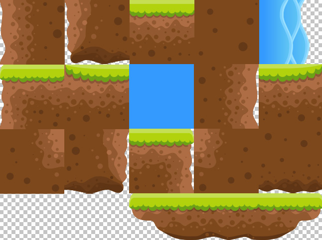

## Jumping onto a platform

Now that RHB crashes into a stone, we'll need to find a way to go over it. Play the game
and try jumping the rock; you'll that notice it's really difficult. The timing has to be just
right.

First, we're going to put a platform above the stone that RHB can jump on to avoid the rock. 

In addition to putting a platform on screen with a new sprite sheet and giving it a bounding box, 
we'll have to handle a new type of collision.

Specifically, we'll need to handle collisions coming from above the platform so that we can
land on it.

### Adding a platform

We'll start by adding the platform from a new sprite sheet. This sprite sheet actually
contains the elements that will make up our map in the upcoming chapters, but we'll use it
for just one platform for now. The sprite sheet looks like this:



The image is divided up into squares that aren't outlined but are visible in the way the
shapes are arranged, called `tiles`. Those squares are the sprites that we'll be mixing and
matching to make various obstacles for RHB to jump over and slide under. The tiles are
also jammed together nice and tight, so we won't have to concern ourselves with any
offsets. 
For the time being, we'll only need the platform at the lower-right corner, which
will float over the stone:


This one is conveniently set up with the sprites in order, so it will be easy to access in the
sprite sheet. You can see those dotted lines now marking the three sprites. 
Let's get it into our game. In the sprite_sheets directory of the assets, you'll find two files, 
`tiles.json` and `tiles.png`. This is the sheet for the tiles, which we'll need to load at startup.
So that we have something to load it into, we'll start by creating a Platform struct in the
`game` module:

```rust
// src/game.rs

struct Platform {
    sheet: Sheet,
    image: HtmlImageElement,
    position: Point,
}

impl Platform {
    fn new(sheet: Sheet, image: HtmlImageElement, position: Point) -> Self {
        Platform {
            sheet,
            image,
            position,
        }
    }
}

```

So far, this just loads up the expected data. At this point, you may note that sheet
and image are paired together repeatedly, which means they are good candidates for
refactoring into a new structure, such as SpriteSheet . We won't do that now because
we don't want to be premature and refactor to a bad abstraction, but we'll keep an eye out
for the duplication if it shows up again.

The platform is going to need two things. It's going to need to be drawn, and it's going to
need a bounding box so that we can land on it. To draw the box, we'll need to draw the
three tiles that make that platform on the bottom together. Looking at tiles.json , it's
hard to tell which platforms we want because the frame names are all just numbers such as
14.png , so just take my word for it that the tiles are 13.png , 14.png , and 15.png.

Let's dive into the draw function for Platform now, which has a little trick in it, as
seen here:

```rust
// src/game.rs

impl Platform {
...
    fn draw(&self, renderer: &Renderer) {
        let platform = self
                        .sheet
                        .frames
                        .get("13.png")
                        .expect("13.png does not exist");
        
        renderer.draw_image(&self.image,
                                &Rect {
                                    x: platform.frame.x.into(),
                                    y: platform.frame.y.into(),
                                    width: (platform.frame.w * 3).into(),
                                    height: platform.frame.h.into(),
                                },
                                &Rect {
                                    x: self.position.x.into(),
                                    y: self.position.y.into(),
                                    width: (platform.frame.w * 3).into(),
                                    height: platform.frame.h.into(),
                                },
                            );
    }

```

The cheat is that we know that the three tiles happen to be next to each other in the
sheet, so instead of getting all three sprites out of the sheet, we'll just get three times the
width of the first sprite. That will happen to include the other two tiles. Don't forget that
the second Rect is the destination and, as such, should use the position field. 

That second rectangle also corresponds to the bounding box of the platform, 
so let's create the platform's bounding box function and use it there instead. 
These changes are shown here:

```rust
// src/game.rs

impl Platform {
    ...

    fn bounding_box(&self) ->Rect {
        let platform = self
                        .sheet
                        .frames
                        .get("13.png")
                        .expect("13.png does not exist");
        
        Rect {
            x: self.position.x.into(),
            y: self.position.y.into(),
            width: (platform.frame.w * 3).into(),
            height: platform.frame.h.into(),
        }
    }//^-- bounding_box

    fn draw(&self, renderer: &Renderer) {
        ...
```

And use `bounding_box` in `draw` to replace the second `&Rect`


```rust
// src/game.rs

impl Platform {
    ...

    fn draw(&self, renderer: &Renderer) {
        ...
        renderer.draw_image(&self.image,
                        &Rect {
                            x: platform.frame.x.into(),
                            y: platform.frame.y.into(),
                            width: (platform.frame.w * 3).into(),
                            height: platform.frame.h.into(),
                        },  
                        &self.bounding_box(),
        );
    }//^-- draw


```


This code has the same troubles as other code where we search for the frame on every
draw and we're doing it twice. We're also constructing `Rect` on every `bounding_box`
call, which we explicitly avoided earlier. 
Why the change? Because we'll be changing how we construct this shortly, 
so it's not worth worrying about saving an extra cycle or two here.

#### drawing the platform

Now that we've made a platform that could theoretically be drawn, let's actually draw it.
First, we'll add it to the Walk struct, as shown here:

```rust
// src/game.rs

struct Walk {
    boy: RedHatBoy,
    background: Image,
    stone: Image,
    platform: Platform,
}

```

Of course, that won't compile because when we create `Walk` , we don't have a platform.
We need to update the initialize function in `WalkTheDog` to fetch the `tiles.json` 
and create a new `Platform` with it and `tiles.png`. And include the new `Platform` 
as shown here:


```rust
// src/game.rs

impl Game for WalkTheDog {
    async fn initialize(&mut self) -> Result<Box<dyn Game>> {
        match self {
            WalkTheDog::Loading => {
                        ...
                        let stone = engine::load_image("../resources/pix/Stone.png").await?;
                        let platform_sheet = browser::fetch_json("../resources/pix/tiles.json").await?;
                        let platform = Platform::new( platform_sheet.into_serde::<Sheet>()?,
                                                      engine::load_image("../resources/pix/tiles.png").await?,
                                                      Point { x: 200, y: 400 },
                                       );

                let walk = Walk {   boy: rhb, 
                                    background: Image::new(background, Point {x:0, y:0}),
                                    stone: Image::new(stone, Point { x: 150, y: 546 }),
                                    platform: platform,
                                };

```

Finally, we create Walk with platform. 
Drawing the platform is a one-line change, adding it to the draw function of WalkTheDog, 
as shown here:

```rust
// src/game.rs

#[async_trait(?Send)]
impl Game for WalkTheDog {
    ...
    fn draw(&self, renderer: &Renderer) {
        ...
        if let WalkTheDog::Loaded(walk) = self {
            walk.background.draw(renderer);
            walk.boy.draw(renderer);
            walk.boy.draw_rect(renderer);
            walk.stone.draw(renderer);
            walk.stone.draw_rect(renderer);
            
            walk.platform.draw(renderer);
        }
    }
}
```

Lets add a `draw_rect` for platform since we already have `bounding_box`

```rust
// src/game.rs

impl Platform {
    ...
    fn bounding_box(&self) ->Rect {
        ...

    fn draw(&self, renderer: &Renderer) {
        ...
        walk.stone.draw_rect(renderer);            
        walk.platform.draw(renderer);
        walk.platform.draw_rect(renderer);
    }

    fn draw_rect(&self, renderer: &Renderer){
        renderer.draw_rect(&self.bounding_box());
    }
```

yeah!


But while the platform has a bounding box, you aren't using it yet, so we'll need to
add that collision to the `update` function of `WalkTheDog`. 

When colliding with the platform, you'll want to **transition** from `Jumping` back to `Running`. 
This transition is already written – we do it when we land on the floor – so you'll just need 
to add a check and an event that can perform the transition.

We'll also need to make sure that RHB stays on the platform. 

Currently, gravity would just pull him right through it, regardless of whether or not 
there's a collision or the player is in the Running state. 

That solution is a little more complex. 

A naive solution, and I know because I wrote it, is to stop applying gravity 
when the player is on the platform. This works until it doesn't, causing a Wile E. Coyote effect 
when RHB runs off the platform and stays in the air. 
Presumably, if he could look down, he would hold up a sign and then crash to the ground.

Instead, what we do is continue to apply gravity on every frame and check whether RHB 
is still landing on the platform. 
If he is, then we adjust him right back onto the top of it. 
This effectively means that RHB "lands" repeatedly until he reaches the end of the platform,
when he falls off. 
Fortunately, this isn't visible to the user, since we calculate RHB's new position on every update, 
and this results in him moving to the right until he falls off the edge, as he should.

---

Let's start by adding the check to the update function so that RHB can land on a platform:


```rust
// src/game.rs

    fn update(&mut self, keystate: &KeyState) {
        if let WalkTheDog::Loaded(walk) = self {
            ...
            
            walk.boy.update();

            // land
            if walk.boy
                   .bounding_box()
                   .intersects(&walk.platform.bounding_box())
            {
                walk.boy.land();
            }

            // knock_out
            if walk.boy
                   .bounding_box()
                    ...
```


The `land` method and its corresponding `Event` don't exist yet. 
You can create them both now, and follow the compiler until you have 
to write the **transition** in the **state machines**, 

```sh
error[E0599]: no method named `land` found for struct `RedHatBoy` in the current scope
   --> src/game.rs:689:26
    |
77  | pub struct RedHatBoy {
    | -------------------- method `land` not found for this struct
...
689 |                 walk.boy.land();
    |                          ^^^^ method not found in `RedHatBoy`
```

So we add the land method

```rust
// src/game.rs

impl RedHatBoy {
    ...
    fn land(&mut self) {
        self.state_machine = self.state_machine.transition(Event::Land);
    }


}//^-- impl RedHatBoy 


pub enum Event {
    Run,
    Slide,
    Update,
    Jump,
    KnockOut,
    Land,
}

```


The **transition** in the **state machines**,  is shown here:

```rust
// src/game.rs

impl RedHatBoyStateMachine {
    fn transition(self, event: Event) -> Self {
        match (self, event) {
            ...
            
            (RedHatBoyStateMachine::Sliding(state), Event::KnockOut) => state.knock_out().into(),
            (RedHatBoyStateMachine::Jumping(state), Event::Land) => state.land().into(),
            
```

Remember that we already wrote a transition method from Jumping to Running, so
you won't need to write it, but this isn't enough to land on the platform. 
The transition will happen, but RHB will fall right through the platform and crash into the ground.

In order to keep `RHB` on the platform, we need to set its `y` position to the top of the bounding box. 
This will mean changing the `Land` event to store the `y` position of the platform's bounding box.

On every intersection with the platform, we'll transition with the `Land` event. 
This means that the `Update` event will pull the player down a bit because of gravity, 
but then the `Land` event will push them right back up. 

Since we don't draw the in-between state, it will look fine. 
This system isn't perfect, but we aren't writing a physics engine. 

Let's do that now; 
we'll start by modifying in `impl Game for WalkTheDog` the `land` function 
in `update` to be `land_on`, taking a `y` position:

```rust
// src/game.rs

impl Game for WalkTheDog {
    ...
    fn update(&mut self, keystate: &KeyState) {
        ...
        // land
            if walk.boy
                   .bounding_box()
                   .intersects(&walk.platform.bounding_box())
            {
                //walk.boy.land();
                walk.boy.land_on(walk.platform.bounding_box().y);
            }
```

Now, `land_on` instead of `land` takes the `y` position of `bounding_box` for the platform.

If you just follow the compiler errors for that, you will eventually need to modify the
`Land` event to hold the position and modify the `land` method on the Jumping typestate.

It will probably look something like this:
```rust
// src/game.rs

impl RedHatBoyState<Jumping> {
    ...
        pub fn land(self) -> RedHatBoyState<Running> {
            RedHatBoyState {
                context: self.context.reset_frame(),
                _state: Running {},
            }
        }
    
```

too

```rust
// src/game.rs

impl RedHatBoyState<Jumping> {
    ...
    pub fn land_on(mut self, position: f32) -> RedHatBoyState<Running> {
        self.context.position.y = position as i16;
        
        RedHatBoyState { 
            context: self.context.reset_frame(),
            _state: Running,
        }
    }//^-- fn land_on

    ...

```


---


This sort of works, but it has another problem. The bounding box is actually changing size
during the animation, based on the current frame of the animation, because the trimmed
sprite shrinks and grows slightly. As we check collisions on every frame, we'll call Land
repeatedly while RHB is on the platform. If we continually change the landing position
based on the current frame's height, the walk ends up looking very "bouncy." Even though
the bounding box is changing slightly, it looks better if we use a constant value for the
player's height for this calculation


We already have the player height adjustment; we just created it as the `FLOOR` constant.
In the `game` module, you'll see that the `FLOOR` constant is set at `479`. 
Well, that means that we can use the `height` of the game (which is 600 ) 
and subtract `FLOOR` to get the player's height. 

We can use that info to create two new constants. 
The first, `HEIGHT`, can be defined in the `game` module as `const HEIGHT: i16 = 600` 
and used wherever we've **hardcoded** the 600 value. 
The second, `PLAYER_HEIGHT`, can be defined in the `red_hat_boy_states` module, as shown here:


```rust
// src/game.rs

...

const HEIGHT: i16 = 600;
...

mod red_hat_boy_states {
    use super::HEIGHT;
    ...
    const FLOOR: i16 = 479;
    const PLAYER_HEIGHT: i16 = HEIGHT - FLOOR;

```
`PLAYER_HEIGHT` belongs in the `red_hat_boy_states` module, since it will only be
used there, but to calculate it, we need to bring in scope `game::HEIGHT` into 
the `red_hat_boy_states` module. 

Now that we have the proper value to adjust RHB when he lands, 
we can account for it in the `land_on` method and `RedHatBoyContext`:

```rust
// src/game.rs
impl RedHatBoyState<Jumping> {
    pub fn land_on(self, position: f32) -> RedHatBoyState<Running> {
            RedHatBoyState {
                context: self.context.reset_frame().set_on(position as i16),
                _state: Running,
            }
    }
    ...
}

```

We've moved the adjustment of RHB's position into a `set_on` method in `RedHatBoyContext`. 
The `set_on` method always adjusts for the player's `height`, which is why it's named `set_on` 
and not set_position_y. 
It also returns `self` so that we won't require `mut self` anymore, 
fitting with the rest of the operations on `RedHatBoyContext`.


```rust
// src/game.rs
impl RedHatBoyContext {
    ...
        fn stop(mut self) -> Self {
           ...
        }

        fn set_on(mut self, position: i16) -> Self {
            let position = position - PLAYER_HEIGHT;
            self.position.y = position;
            self
        }
```

Changing the land method to the `land_on` method also requires you to modify what it
is called within the update method of `RedHatBoyState<Jumping>`. 
After all, there is no land method anymore. 
Keep in mind that we have to account for the height when calling `set_on`, as shown here:


```rust
// src/game.rs

impl RedHatBoyState<Jumping> {
    pub fn update(mut self) -> JumpingEndState {
        self.update_context(JUMPING_FRAMES);

        if self.context.position.y >= FLOOR {
            JumpingEndState::Landing(self.land_on(HEIGHT.into()))
        } else {
            JumpingEndState::Jumping(self)
        }

    }


```

Here, we are checking whether `RHB` is past `FLOOR` and pushing it back up to `HEIGHT`.

Remember that When we call `land_on` we send the position of RHB's feet, not his head.
You could argue that the update method shouldn't check for hitting the ground and that
the higher-level update method in WalkTheDog should check for collisions with the
ground and use the Land event when appropriate. I think I'd agree, but we've made more
than enough changes for this chapter, so we'll stick with it as it is for now.

**Not falling through**.

This adjusts the position of RHB for landing. 
He'll be positioned on the platform or the ground at the end of his jump. 

Now, we need to make sure that the Land event prevents RHB from falling 
through the platform right after he lands. 

The Land event will happen while Running occurs on the platform, but it isn't handled, 
so you'll fall right through because gravity takes effect. 

We're going to need a Land transition for every state that is valid on the platform, 
where the state stays the same but the y position is forced back to the top of the platform.


First change `Land` to `Land(f32):

```rust
// src/game.rs


pub enum Event {
    Run,
    Slide,
    Update,
    Jump,
    KnockOut,
    Land(f32),
}
```
Next we'll handle the Land event for Running in the transition method:

```rust
// src/game.rs

impl RedHatBoyStateMachine {
    fn transition(self, event: Event) -> Self {
        match (self, event) {
            ...
            (RedHatBoyStateMachine::Running(state), Event::Land(position)) => {
                state.land_on(position).into()
            },

```
Then, we'll add a `land_on` method to the `RedHatBoyState<Running>` typestate, as shown here:

```rust
// src/game.rs

    #[derive(Copy, Clone)]
    pub struct Running;

    impl RedHatBoyState<Running> {
        ...
        pub fn land_on(self, position: f32) -> RedHatBoyState<Running> {
            RedHatBoyState {
                context: self.context.set_on(position as i16),
                _state: Running {},
            }
        }
    }//^-- impl RedHatBoyState<Running>

```
For every `Land` event in the `Running` state, you adjust the position and stay in the
Running state. With that, you should see RHB jump onto a platform

```rust
// src/game.rs

impl RedHatBoyStateMachine {
   fn transition(self, event: Event) -> Self {
       match (self, event) {
        ...
        (RedHatBoyStateMachine::Sliding(state), Event::KnockOut) => state.knock_out().into(),
        (RedHatBoyStateMachine::Jumping(state), Event::Land(position)) => state.land_on(position).into(),
        (RedHatBoyStateMachine::Running(state), Event::Land(position)) => state.land_on(position).into(),
        _ => self,
       }
   }
```


Running on the platform is beginning to work, but you'll find a strange bug if you try to
run past the edge of the platform. RHB falls through the bottom!

It turns out there is a fairly sneaky bug with the way we are handling gravity, which we'll
call the "terminal velocity" bug, and we can address that next.


**Terminal velocity**

We add 1 to the gravity on every update until the player jumps again. 


```rust
// src/game.rs

mod red_hat_boy_states {
...

    const GRAVITY: i16 = 1;

    ...

    impl RedHatBoyContext {
        pub fn update(mut self, frame_count: u8) -> Self {
            self.velocity.y += GRAVITY;

...

```

This means that, eventually, the gravity gets so large that the player is pulled completely
below the platform on an update, and he actually stops intersecting it. 
Our platform is currently at 400. When the player lands on it, he is at 279, 
the platform's y-axis minus the player's height. 

On the first frame, we pull him down by 1 for gravity, 
check whether that intersects the platform (it does), and land. 
On the next frame, we pull him down by 2, the next by 3, and so on. 
Eventually, we actually pull him completely beneath the platform, 
he does not intersect it, and boom – he's suddenly below the platform. 

We need to fix that by giving gravity a terminal velocity.

In the real-world, terminal velocity is the fastest attainable speed by an object as it falls
because of the drag of the air around it (see https://go.nasa.gov/3roAWGL for
more information). We aren't going to calculate RHB's true terminal velocity, as there's no
air in his world, but we can use the very scientific method of picking a number and seeing
whether it works. We'll set a maximum positive y velocity of RHB to 20 and clamp his
updates to that. That will live in the RedHatBoyContext update method, where we
are already modifying y for gravity. The code for that is shown here:

```rust
// src/game.rs

mod red_hat_boy_states {
    ...
    const GRAVITY: i16 = 1;
    const TERMINAL_VELOCITY: i16 = 20;

    impl RedHatBoyContext {
        pub fn update(mut self, frame_count: u8) -> Self {
            //self.velocity.y += GRAVITY;
            
            if self.velocity.y < TERMINAL_VELOCITY {
                self.velocity.y += GRAVITY;
            }

            if self.frame < frame_count {
                ...
```

Clamping the velocity at 20 fixes our issue with falling through the platform, 
and now RHB falls off the platform at the end as he should. 

However, if you try to slide (push the arrow down), 
you'll see that RHB falls right through the platform. 
That's because the Sliding state doesn't respond to the Land event. 

You can fix that in the exact same way you fixed Running, which is an exercise for you. 

One hint – when you stay in the same state, you don't call `reset_frame`!

```rust
    impl RedHatBoyState<Sliding> {

        pub fn land_on(self, position: f32) -> RedHatBoyState<Sliding> {
            RedHatBoyState {
                context: self.context.set_on(position as i16),
                _state: Sliding {},
            }
        }
```
and 

```rust
// src/game.rs

impl RedHatBoyStateMachine {
    fn transition(self, event: Event) -> Self {
        match (self, event) {
            ...
            (RedHatBoyStateMachine::Sliding(state), Event::Land(position)) => state.land_on(position).into()
...
```
           

That's almost the end of it, but there are two more things to take care of – crashing into
the bottom of the platform and transparency in the bounding boxes.


--------------

```rust
// src/game.rs


```

